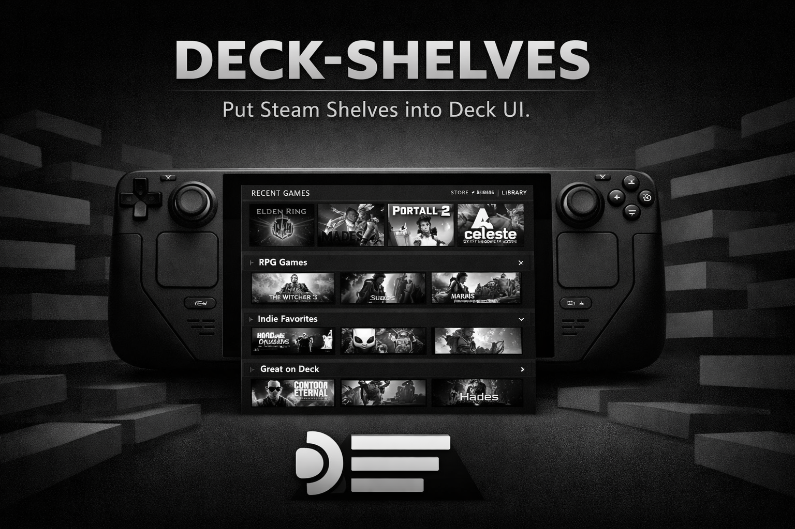
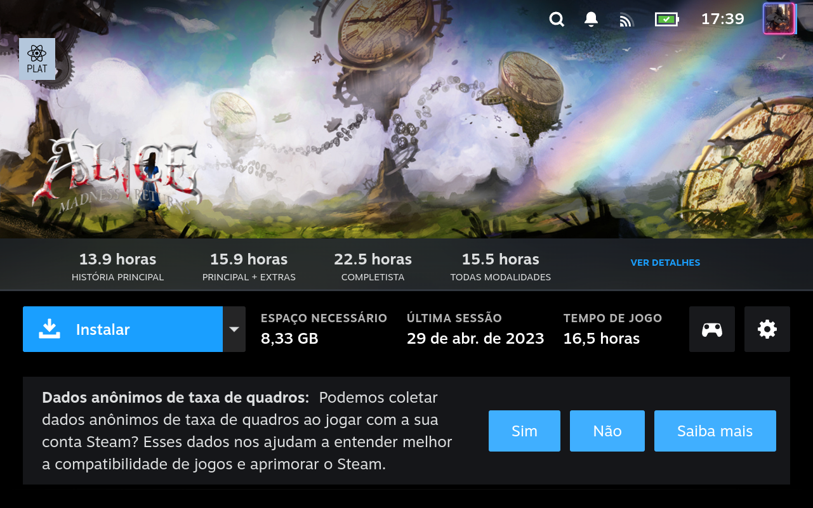

# Deck Shelves

<p align="center">
  
</p>

[](https://github.com/santojon/Deck-Shelves/actions/workflows/ci.yml)
[](https://github.com/santojon/Deck-Shelves/actions/workflows/release.yml)
[](https://github.com/santojon/Deck-Shelves/releases/latest)
[](LICENSE)
[](scripts/build/validate-compat.sh)


[](https://github.com/sponsors/santojon) [](https://ko-fi.com/santojon)

A [Decky Loader](https://decky.xyz) plugin for Steam Deck that injects configurable shelves into the Home screen with a built-in Quick Access Menu editor.

<p align="center">
  
</p>

## Features

- Inject custom shelves into `library/home`
- Shelves backed by **collections**, **library tabs**, or **custom filters**
- Filter games by:
  - Favorites, installed, hidden, non-Steam
  - Name (substring or regex)
  - Deck compatibility level
  - Playtime range (min / max minutes)
  - Played within N days
  - Update pending
- Sort shelves alphabetically, by recent play, or by total playtime
- Reorder and toggle shelf visibility from the QAM
- Import / export all shelves as JSON
- Persistent settings across plugin reinstalls
- Multi-language support (en, pt-BR, de, es, fr, it)

### Screenshots
#### Home

<p align="center">
  
</p>

<p align="center">
  
</p>

#### Plugin Settings

<p align="center">
  
</p>

#### Game Actions

<p align="center">
  
</p>

<p align="center">
  
</p>

#### Shelf Management

<p align="center">
  
</p>

<p align="center">
  
</p>

<p align="center">
  
</p>

<p align="center">
  
</p>

<p align="center">
  
</p>

<p align="center">
  
</p>

## Installation

### From Decky Store

1. Install [Decky Loader](https://decky.xyz) on your Steam Deck
2. Open the Decky Store and search for **Deck Shelves**
3. Install and restart Steam if prompted

### Manual Installation

1. Download the latest `Deck-Shelves-v*.zip` from the [Releases page](https://github.com/santojon/Deck-Shelves/releases/latest)
2. In game mode, go to Decky config page -> Developer -> Install from zip file
3. Select the downloaded zip file and confirm
4. Restart Steam if prompted

## Development

### Prerequisites

- Node.js 20+
- pnpm 10+
- Python 3 (for backend)
- SSH access to a Steam Deck on the local network

### Setup

```bash
pnpm install
pnpm run deck:setup steamdeck
```

### Environment variables

Deploy and diagnostics scripts need to know how to reach your Steam Deck over SSH. Create a `.env` file in the project root (it is git-ignored) with the following variables:

```env
# Steam Deck SSH hostname or IP address
DECK_HOST=steamdeck

# Steam Deck SSH username (default: deck)
DECK_USER=deck

# Steam Deck sudo password (used for plugin_loader restart, permission fixes, etc.)
DECK_SUDO_PASS=your-password

# Steam Deck CEF remote-debug port (default: 8081)
DECK_CDP_PORT=8081
```

All variables are optional — each script also accepts command-line arguments (e.g. `pnpm run deploy:deck steamdeck`). When both are provided, the CLI argument takes precedence.

### Build

```bash
# Development build (sourcemaps, no minification)
pnpm run build:plugin

# Production / release build (minified, no sourcemaps)
pnpm run build:release
```

### Deploy & Watch

```bash
# Deploy current build to Deck
pnpm run deploy:deck steamdeck

# Watch for changes and auto-deploy
pnpm run watch:deck steamdeck
```

### Package

```bash
# Create installable zip
pnpm run package

# Upload zip to Deck Downloads folder
pnpm run upload:deckzip steamdeck
```

## Architecture

```
main.py                  Python backend (settings persistence, import/export)
src/index.tsx            Plugin entry point
src/runtime/             Steam/Decky integration, Home injection, platform layer
src/components/          QAM settings UI and Home shelf rendering
src/domain/              Settings schema, defaults
src/core/                Steam asset helpers
src/shims/               React/Decky runtime shims for GamepadUI
src/features/settings/   Settings controller
i18n/                    Locale files (6 languages)
checks/                  Compatibility validation scripts
scripts/                 Build, deploy, watch, package helpers
```

## Compatibility

All checks can be run with:

```bash
bash scripts/build/validate-compat.sh
```

### Build

| Check | Status |
|---|---|
| Build Output (Vite/ESM) | ✅ |
| TypeScript / Node (Build Toolchain) | ✅ |

### Decky Loader

| Check | Status |
|---|---|
| Decky Loader 3.x (API v1) | ✅ |
| Decky Loader (API v1) | ✅ |
| Decky Store (Publishing) | ✅ |
| Decky Store Submission (Review Checklist) | ✅ |

### SteamOS

| Check | Status |
|---|---|
| SteamOS 3.5 (Stable) | ✅ |
| SteamOS 3.6 (Beta) | ✅ |
| SteamOS 3.7 (Preview) | ✅ |
| SteamOS 3.8 (Preview/Beta) | ✅ |
| SteamOS GamepadUI (3.5–3.8) | ✅ |

### Plugins

| Check | Status |
|---|---|
| TabMaster (Coexistence) | ✅ |
| UnifiDeck (Coexistence) | ✅ |
| CSS Loader (Coexistence) | ✅ |
| Obsidian Theme (CSS Loader Theme) | ✅ |
| CheatDeck (Coexistence) | ✅ |
| HLTB (Coexistence) | ✅ |
| SteamGridDB (Coexistence) | ✅ |

### Project

| Check | Status |
|---|---|
| Internationalization (i18n) | ✅ |
| Python Backend (Decky Python) | ✅ |

## Developer Tools

The project includes CDP-based diagnostics and screenshot automation for Steam Deck development. See [scripts/devtools/README.md](scripts/devtools/README.md) for details on:

- **CDP probe** — runtime mount, row, and smoke-test checks
- **Deck diagnostics** — SSH-based diagnostic wrapper
- **Screenshot capture** — automated screenshot capture via CDP for documentation

## Contributing

See [CONTRIBUTING.md](CONTRIBUTING.md) for development guidelines, code style, and how to submit changes.

## About

Deck Shelves is developed by [Jonathan Santos](https://github.com/santojon).

[](https://ko-fi.com/santojon)
