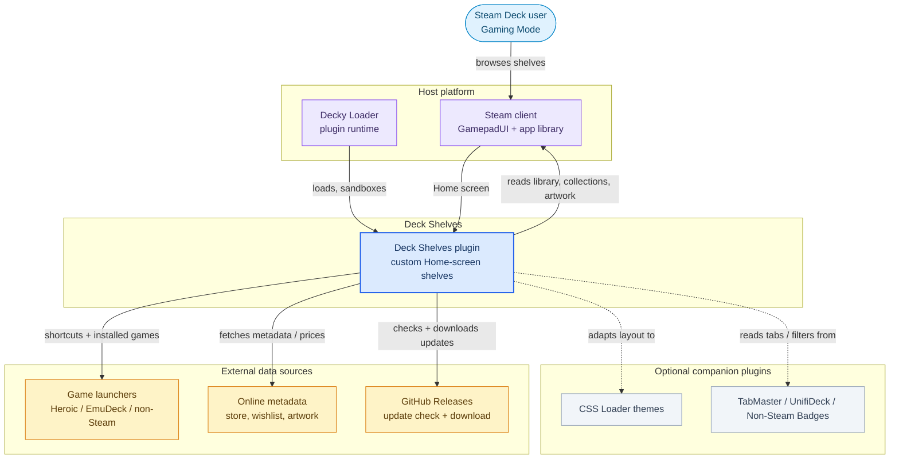
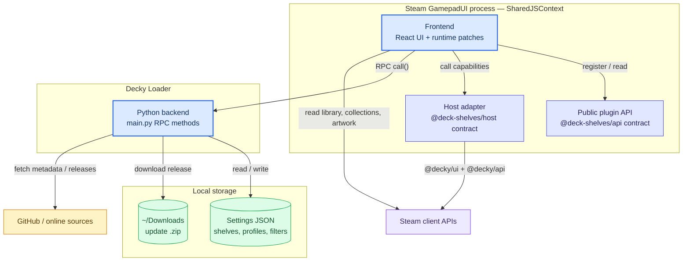
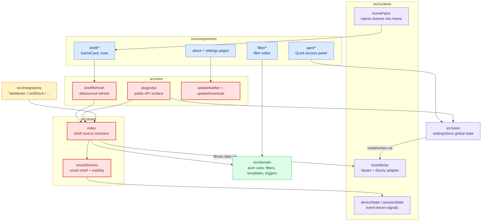

# Architecture

Deck Shelves is a plugin that injects custom game shelves into the Steam Deck home screen. This document describes the project structure and how the main systems connect.

<p align="center">
  
</p>

## System overview

### The plugin in its environment

Deck Shelves runs inside Decky Loader, renders into Steam's Gaming Mode home
screen, and reads from the local library plus a few optional external sources.



### Runtime pieces

The frontend runs in Steam's GamepadUI process (`SharedJSContext`); a small
Python backend owns filesystem and outbound network access. Steam and Decky are
reached only through the host adapter; external plugins register through the
public API.



### Frontend modules

Work flows from a home render down to resolved shelf contents. Modules outlined
in **red** are the sensitive ones — shelf resolution, refresh and the public API
surface — where changes carry the most risk. `src/domain` (green) is pure logic
with no side effects, and the state modules are event-driven with no polling.



## Directory Structure

```
src/
├── index.tsx Plugin entry point
├── types.ts Zod schemas: Shelf, Settings, FilterGroup
├── i18n.ts i18next initialization
│
├── components/ React UI
│ ├── HomeInject.tsx Portal renderer for home screen shelves
│ ├── DeckRow.tsx Shelf row layout (imports shelf/ modules)
│ ├── Shelf.tsx Single shelf data resolver (memoized + generation-id cancel)
│ ├── DeckQAMSettings.tsx Quick Access Menu settings panel
│ ├── FilterPanel.tsx Filter group editor UI
│ ├── AboutPage.tsx About / documentation page
│ ├── Settings.tsx Settings page wrapper
│ ├── SettingsPage.tsx Two-pane Settings shell (left toggle list + right card grid)
│ ├── ErrorBoundary.tsx React error boundary
│ ├── icons.tsx Shared feather-style SVG icons (FunnelIcon, EyeIcon, …)
│ ├── home/navPatches/ Split nav-patch modules (one concern per file)
│ │ ├── reparent.ts reparentNavTreeNodes — splice between recents and tabs
│ │ ├── menuButton.ts MENU button → game context menu
│ │ ├── edgeNavigation.ts L/R throttle + DOWN tilt guard (when home tabs hidden)
│ │ ├── verticalBridge.ts DOWN/UP bridge between mount and native neighbors
│ │ └── constants.ts DIR_*, DS_*_PATCHED, OPTIONS_BUTTON
│ ├── filter/ Filter group editor (recursive UI)
│ ├── ui/ Shared domain-agnostic primitives
│ │ ├── ModalShell.deck-shelves-modal-scope + DeckModalStyles
│ │ ├── FieldContainer.field-item-container + scrollable mode (focusin → scrollIntoView)
│ │ ├── LabeledTextField Field + TextField + textFromDeckyChange
│ │ ├── CollapsibleSection QAM collapsible section with localStorage state
│ │ └── PageHeader Back arrow + title + trailing slot for dedicated routes
│ ├── settings/ Two-pane Settings shell parts (SettingsPage children)
│ │ ├── SettingsLeftPane Left toggle list (mirrors sidecar's GeneralTab) + PageHeader
│ │ ├── SettingsCardGrid Right 2×3 grid of SettingsCard tiles
│ │ ├── SettingsCard Single tile primitive (icon + title + description)
│ │ ├── SettingsDetailPanel Slide-in right panel (B closes) — dispatches per card
│ │ └── details/ One file per card detail panel
│ │ ├── QuickDetail QAM-visibility eye-hide manager
│ │ ├── ShelvesDetail Regular + smart shelves CRUD (chips, edit/delete, unified reorder ↑↓)
│ │ ├── ProfilesDetail Usage profiles (save, apply, duplicate, rename, delete)
│ │ ├── IntegrationsDetail Plugin descriptors with per-row enable/disable
│ │ ├── BackupDetail 3-scope import/export wrap (regulars, smart, all)
│ │ └── AdvancedDetail Live diagnostics log + factory-reset triple
│ ├── qam/
│ │ ├── common/
│ │ ├── list/
│ │ └── modals/
│ │ ├── EditShelfModal.tsx Regular shelf editor
│ │ ├── EditSmartShelfModal.tsx Smart shelf editor (sort override, filterGroup, smartParams, refresh interval)
│ │ ├── (Export/Import/Template/ResetAll/Delete/ImportFromCustomFilters with `scope`)
│ │ └── editShelf/ Components shared by both edit modals
│ │ ├── HighlightMiniCard.tsx Mini-card with fallback art chain + chevrons + selected/grabbed states
│ │ ├── HighlightRow.tsx Horizontal row with focus-centered scroll + re-center
│ │ ├── ManualSortRow.tsx Manual order row — gamepad grab + pointer-hold drag + chevrons
│ │ ├── SavedFiltersBar.tsx Saved-filters dropdown + "save current"
│ │ ├── VisualTabContent.tsx Toggles + highlight picker + odd/even patterns + preview
│ │ ├── DisplayTabContent.tsx hide-* toggles (status line, install indicator, new badge, compat icons, non-steam, shelf title, game names)
│ │ ├── ModalHeader.tsx Title + preview counter
│ │ └── constants/types/utils.ts
│ ├── shelf/
│ │ ├── types.ts DeckRowItem, card dimensions, REFRESHABLE_SMART_MODES
│ │ ├── shelfStyles.ts CSS injection, native dim discovery, ds-refresh-spin keyframes, TiltedHome compat
│ │ ├── GameCard.tsx Game card with native class injection + label/status gates
│ │ ├── MoreCard.tsx "View more" trailing tile (non-smart shelves)
│ │ ├── RefreshCard.tsx Refresh trailing tile (refreshable smart shelves and sort=random)
│ │ ├── PlaceholderCard.tsx Fallback card
│ │ └── HeroBackground.tsx Two-layer cross-fade hero art + ArtHero label overlay
│ ├── about/
│ │ ├── DocSection.tsx
│ │ ├── DocCallout.tsx
│ │ ├── DocAccordion.tsx
│ │ ├── OverviewPage.tsx / HowToPage.tsx / ShelvesPage.tsx / FiltersPage.tsx
│ │ ├── SortPage.tsx / SmartShelvesPage.tsx / SupportPage.tsx
│ └── styles/
│ ├── DeckModalStyles.tsx
│ └── DeckQAMStyles.tsx
│
├── steam/
│ ├── index.ts Steam API access: app overviews, collections,
│ │ tabs, filters, sorting, developer data (~3500 LoC).
│ │ Dispatches first-party v3 ids through `v3Extensions`
│ │ BEFORE the external-plugin fallback so collisions
│ │ resolve to built-in implementations.
│ ├── v3Extensions.ts First-party Filter v3 (32 evaluators), Sort v3 (25
│ │ comparators), Shelf Source Ecosystem v3 (19
│ │ resolvers) + descriptive registry entries used
│ │ by `internalRegistry.ts` to surface them via
│ │ the public Plugin API.
│ └── smartShelves.ts Smart-shelf candidate resolution per mode
│
├── store/
│ └── settingsStore.ts Settings persistence: backend RPC + localStorage cache
│
├── core/
│ ├── focusRestore.ts Focus restoration after navigation
│ ├── scrollUtils.ts Centered scroll calculation
│ ├── shelfRefresh.ts Global shelf refresh emitter
│ ├── steamAssets.ts Image URL generation (portrait, landscape, hero)
│ ├── steamGameMenu.ts Native game context menu extraction
│ ├── webpackCompat.ts Runtime class discovery (viewport + native shelf/card/section tokens)
│ ├── reorder.ts useContainerDragReorder + pure helpers (findReorderTargetIndex, moveInOrder)
│ ├── cssLoaderDetect.ts isCssLoaderActive(), isArtHeroActive(), getNativeRecentsClassName()
│ ├── steamOSVersion.ts getSteamOSVersion() helper
│ ├── pluginApi.ts Public inter-plugin API (v2)
│ └── perf.ts Performance marks/measures
│
├── domain/
│ ├── settings.ts Pure settings operations (patch, add, delete, move)
│ ├── defaults.ts Default shelf/settings/filter factories
│ ├── templates.ts Shelf preset templates (11 entries)
│ ├── shelfOrder.ts pickFirstVisibleShelfId + interleaveSmartShelves (pure helpers)
│ └── customfilters.ts TabMaster filter conversion
│
├── features/
│ └── settings/
│ ├── controller.tsx Hook entry (state + effects + spread compose)
│ └── controller/ Action slices (composed via spreads)
│ ├── shelves.ts Regular-shelf CRUD + import/export/reset
│ ├── smartShelves.ts Smart-shelf CRUD + surprise-me + import/export
│ ├── savedFilters.ts SavedFilter + SavedSmartFilter CRUD
│ ├── online.ts Online-features toggles + acceptOnlinePrivacy
│ ├── globalVisual.ts 30 global visual setters (consolidated)
│ └── profiles.ts Usage profiles + unified/lightMode/featureToggle setters
│
├── integrations/
│ ├── index.ts Integration barrel
│ ├── registry.ts Plugin detection (TabMaster, UnifiDeck)
│ ├── tabmaster.ts TabMaster settings file reader
│ ├── unifideck.ts UnifiDeck non-Steam app detection
│ └── domtabs.ts DOM-based tab discovery
│
├── runtime/
│ ├── homePatch.tsx Home screen DOM patching + fallback renderer
│ ├── recentsReplace.tsx Experimental: replaces native recents data source with first shelf
│ ├── steamHost.ts Steam window/document discovery
│ ├── deckyPlatform.ts Platform interface implementation
│ ├── platform.ts Platform interface definition
│ ├── platformContext.tsx React context provider
│ ├── logger.ts Colored console logger (__DEV__ gated)
│ ├── diagnostics.ts Diagnostic event collection
│ ├── systemEvents.ts Suspend/resume event handlers
│ └── embeddedClassMap.ts Bootstrap webpack class seed
│
├── shims/ React/Decky UI shims for GamepadUI environment
│
└── test/ Vitest + Python test suites
 ├── steam/ applyManualOrder, evaluateFilterGroup, smartShelves
 ├── components/ refreshableSmartModes
 ├── core/ reorder, webpackCompat
 ├── domain/ settings, customfilters, shelfOrder, templates, schemas
 ├── qa/ qam-visibility
 ├── stubs/ decky-api / decky-manifest stubs (vitest aliases)
 ├── steam.test.ts
 ├── scrollUtils.test.ts
 └── test_main.py Python sanitizer tests (pytest)

main.py Python entry: DEFAULT_SETTINGS, _SSL_CTX, Plugin class
 (lifecycle + RPC). Re-exports helpers from below.
paths.py _steam_install_candidates, _normalize_path
 (path discovery + home-confined validation)
storage.py _settings_dir, _primary_file, _safe_read_json
 (settings.json read helpers, env-var aware)
sanitizer.py _sanitize_settings (settings-shape normaliser,
 mirrors the Zod schemas in src/types.ts)
launchers.py External launcher discovery probe :
 EmuDeck / RetroDECK / Heroic / Lutris / Moonlight /
 Chiaki. stdlib-only (configparser, sqlite3, json),
 every helper degrades to [] on missing dir / parse
 error. Exposed via Plugin RPCs
 list_available_launchers + list_launcher_games.
plugin.json Plugin manifest
```

## Data Flow

```
Settings (backend JSON) → settingsStore → controller → HomeInject → Shelf → DeckRow → GameCard
 ↓
 homePatch (fallback DOM renderer)
```

1. **Settings** are persisted by the Python backend (`main.py` → atomic write via `paths.py` + `storage.py`; shape-checked through `sanitizer.py` on every read AND write) and cached in `localStorage`
2. **`settingsStore`** manages the cache, backend RPC calls, and subscriber notifications
3. **`controller`** (React hook) provides actions and state to QAM components
4. **`HomeInject`** creates a portal into the Steam home screen DOM
5. **`Shelf`** resolves app IDs for each shelf source (collection, tab, filter)
6. **`DeckRow`** renders the horizontal card row with scroll management
7. **`homePatch`** provides a fallback DOM renderer when React portal is unavailable

> **Note:** `HomeShelves` runs in `SharedJSContext`, but the portal is mounted into the Big Picture document. Any DOM query (e.g. `querySelector`) must use `getPreferredSteamDocument()` — querying `document` directly will target the wrong context and silently return nothing.

## Key Systems

### Native Class Discovery (`webpackCompat.ts`)
Steam's GamepadUI uses webpack-hashed CSS classes that change on updates. The plugin discovers these at runtime by inspecting the DOM and stores them in `window.__DS_CLASS_MAP__`. This allows shelf cards to receive native Steam classes for CSS Loader theme compatibility.

> **Caution:** class tokens in `window.__DS_CLASS_MAP__` are tied to specific SteamOS builds. A Steam update can rename them silently. The `webpackCompat` discovery re-runs on mount — never cache tokens in plugin settings or hardcode them in application logic.

### Navigation Integration (`home/navPatches.ts`)
The plugin integrates with Steam's `FocusNavController` gamepad navigation system:
- Reparents shelf nav tree nodes into the correct position
- Patches `BTryInternalNavigation` to prevent horizontal focus escape
- Intercepts the Options button to show the native game context menu

> **Caution:** `home/navPatches.ts` is the most fragile part of the codebase. It monkey-patches `FocusNavController` on a single shared prototype. Any error here can break gamepad navigation across the entire Steam UI. Changes must be minimal and always preserve the stability guard that re-runs the reparent on remount.

### Hero Background (`shelf/HeroBackground.tsx`)
The hero background replicates the exact native SteamOS "Recent Games" hero structure, discovered via Chrome DevTools Protocol (CDP) inspection on SteamOS 3.8:

| Layer | Native Role | Implementation |
|-------|-------------|----------------|
| `IMG` | Hero art with `grayscale(1) contrast(1)`, 0.3s fade-in animation | Applies discovered or fallback filter + animation |
| Zoom container | 25s slow zoom (`ease 0s 1 alternate`) | Discovered animation or `@keyframes ds-hero-zoom` fallback |
| Mask wrapper 1 | `mask-image: radial-gradient(75% 83% at 50% 18%,...)` | Applied via inline style with webkit prefix |
| Mask wrapper 2 | Same radial-gradient mask (double masking for stronger fade) | Second nested div with identical mask |

The native hero does **not** use linear gradients or pseudo-elements for the bottom fade. The vignette effect is entirely achieved via radial-gradient `mask-image` on two wrapper divs, creating a soft oval reveal centered at 50% 18% (upper center).

At runtime, the component discovers native classes from the recents section's sibling element and applies them for CSS Loader theme compatibility.

### Performance Strategy
- `MutationObserver` replaces polling where possible (HomeInject, ShelvesContainer, navPatches)
- Single global timer for `ensureStyles()` shared by all shelf rows
- Focus restore uses MutationObserver with 500ms→2s polling fallback
- `logInfo()` is a no-op in production builds (`__DEV__` flag)
- Collection cache uses 60s TTL; smart-shelf resolver cache TTL defaults to 60 min (per-shelf override via `refreshIntervalMinutes`)
- Native dimension changes require 4px tolerance + 2-cycle confirmation
- `Shelf` is `memo`ized + carries a generation-id token on each `resolveShelfAppIds` call; in-flight resolves drop their `then`/`catch` if a newer one started, so a slow previous resolve cannot overwrite a newer result
- nav-tree reparent poll throttled from 750 ms → 3000 ms (relies on MutationObservers + focusin for fast paths)

> **Note:** the API surface at `window.__DECK_SHELVES_API__` is **v2** — registries (`registerShelfSource` / `registerSmartShelfSource` / `registerFilterType` / `registerSortOption` / `registerImportType` / `registerSavedFilter`) are wired and live; the consumer-side accessors (`getShelves`, `getSmartShelves`, `getSavedFilters`, `subscribeTo*`) are stubbed and connect to the live `settingsStore` in v2.0.0. See [`plugin-api.md`](./plugin-api.md).

### Recents Replace (`recentsReplace.tsx`)
Experimental feature (`recentsReplaceSource` setting, gated behind `hideRecents`). Instead of visually hiding the native "Recently Played" section, it patches the section's render output via `routerHook.addPatch("/library/home",...)` + nested `afterPatch` calls to replace the `games` prop with the first visible shelf's app IDs. The native DOM, CSS, animations, hero background, and focus callbacks are preserved entirely. Safety mechanisms:
- App IDs are filtered by `app_type` (1 = Game, 2 = Application) before injection — shortcuts, DLC, and music entries crash Steam's `userCollections` getter.
- A global `error`/`unhandledrejection` trap detects `userCollections`-class errors and auto-disables the experiment.
- On failure, `isRecentsReplaceInjecting()` returns `false` and `HomeInject` falls back to the standard visual-hide behaviour. The QAM shows a `RecentsReplaceErrorBanner`.

### Hide Home Tabs (`hideHomeTabs`)
When enabled, hides the native Novidades/Amigos/Recomendados tab bar. Detection uses `[role="tablist"]` as a sibling of the plugin's mount element — no hardcoded class names, compatible with SteamOS updates.

> **Note:** the hero does **not** use linear gradients or pseudo-elements for the bottom vignette. The fade is achieved entirely via `mask-image: radial-gradient(...)` on two nested wrapper divs — matching the native structure discovered via CDP. Replacing it with a CSS gradient would break CSS Loader theme compatibility.

### Plugin API (`pluginApi.ts`)
External plugins can register custom shelf sources, filter types, sort options, smart-shelf modes, import formats, statistics/recommendation providers, runtime translations, and pre-baked saved filters at runtime. `pluginApi.ts` is the authoritative runtime that exposes `window.deckShelves`; the canonical types live in the `@deck-shelves/api` package (`api/src/types.ts`), which it imports for leaf types and re-declares the interface against — keep both in sync. Everything first-party (the built-in statistics providers, v3 filters/sorts/sources, …) registers through the **same** registries third-party plugins use. The full API is documented in [`plugin-api.md`](./plugin-api.md). Quick example:
```ts
const cleanup = window.__DECK_SHELVES_API__.registerShelfSource({
 id: "my-plugin-source",
 displayName: "My Custom Source",
 resolve: async (limit) => [appid1, appid2,...],
});
```

### Statistics (`domain/statistics.ts` + `steam/statistics.ts`)
Pure aggregation in `domain/statistics.ts` (`computeLibraryStatistics`, `computeShelfStatistics`, `summarizeHistory`, `deriveSuggestions`) — no Steam APIs, no side-effects. The adapter in `steam/statistics.ts` gathers real data (`getAllAppOverviews`, settings) and exposes two built-in `StatisticsProviderDescriptor`s registered through the plugin API. The Settings → Statistics tab consumes the registry, rendering one area per provider; "over time" averages come from a per-day localStorage snapshot (no timer/polling).

### i18n (`i18n.ts`)
Locales are sliced into `i18n/<locale>/<area>.json` (home / qam / about / settings / integrations / common). The loader merges every area file per locale via `import.meta.glob` — `en-US` eager, others lazy. External integrations add strings at runtime through `api.registerTranslations(locale, dict)`. `validate.mjs` enforces per-locale key-set parity + no cross-area collisions.

### CSS Loader / ArtHero / TiltedHome compat (`core/cssLoaderDetect.ts`)
- `isCssLoaderActive()` / `isArtHeroActive()` read `<style class="css-loader-style">` tags in the active document.
- `getNativeRecentsClassName(mountEl)` reads the live native-recents wrapper class from `mountEl.previousElementSibling` — never hardcoded.
- When `hideRecents=true` and a CSS Loader theme is active, `HomeInject` adds `data-ds-recents-slot="true"` plus the live wrapper class to the first DS shelf — additively (existing `ds-*` classes are preserved). Invariants enforced by the guard chain are documented inline in `HomeInject.tsx`.
- ArtHero label overlay (in `HeroBackground.tsx`) clones the focused card's `.ds-card-label` as a `position: fixed` overlay above the row; tracks the focused card horizontally on row scroll; reactive to runtime CSS Loader toggles via `MutationObserver` on the Big Picture document's `<head>`.
- TiltedHome compat applies `skew(var(--ren-tilt-angle))` to the entire `.ds-card` (image + label + glow + MoreCard + RefreshCard). Focus state composes `skew + scale + translateZ` with `!important` to win over Steam's higher-specificity `.BasicUI.NATIVE.Focusable:focus { transform: translateZ(15px) }` rule. The selector intentionally omits `.gpfocuswithin` (Steam applies that to every card when any descendant of the row has focus — including it would scale every card and erase the focus indicator).

### Refresh card on shelves (`shelf/RefreshCard.tsx` + `shelf/types.ts > REFRESHABLE_SMART_MODES`)
Smart shelves whose result can change between two clicks (`random_pick` / `time_of_day` / `spare_time` / `recently_played`) get a Refresh card instead of the "view more in library" tile. Non-smart shelves with `sort === "random"` also get the Refresh card (it's the only non-smart case whose order can change between clicks; clicking clears the `ds-random-*` localStorage cache and re-resolves only that shelf). Spin animation is driven by a CSS keyframe via DOM class toggle (`.ds-refresh-spinning` on `iconRef`) — not React state, so `setAppIds()` reconciliation cannot cancel the animation mid-flight. Per-shelf `hideRefreshCard` and global `globalHideRefreshCard` suppress the trailing refresh card without changing recompute / cache cadence; `hideSeeMore` / `globalHideSeeMore` mirror the same per-shelf vs. global pair for the trailing "See more" card.

### Filter system (`steam/index.ts > evaluateFilterGroup` + `components/filter/`)

Filter groups are AND/OR predicates evaluated against a single source pool — never list-unions. The full library flows through `evaluateFilterGroup` once and each app is tested against every item independently. `merge` is a special filter type that wraps a nested predicate group with its own `mode: "and" | "or"` plus a sub-`items` array — useful for composing OR-of-predicates inside an outer AND group (e.g. `merge { or, [installed, nonSteam] }` to surface "Steam installed OR any non-Steam app" in one shelf). Sub-filters are edited via the recursive `MergeFilterOptions` component which renders a `<FilterPanel>` for the children; saved filters can be applied at any merge level.

Asc/desc inversion is a separate boolean (`Shelf.sortReverse` / `SmartShelf.sortReverse`, plus `manualBaseSortReverse` for the manual case) toggled by a 40×40 icon button next to the sort dropdown in `EditShelfModal` / `EditSmartShelfModal`. The flag flows through `resolveShelfAppIds(source, limit, sort, shelfId, sortReverse)` to `applySortToIds`, which reverses the result post-sort. Skipped for `manual` (would invalidate user order) and `random` (re-reversing a shuffle adds no signal). When no explicit sort is persisted but reverse is on, `Shelf.tsx` substitutes `"alphabetical"` as the resolver sort so the reverse has somewhere to apply. The `"alphabetical"` branch in `applySortToIds` is **explicit** — without it, the internal sort registry's noop pass-through descriptor would intercept and skip sorting.

Native Steam library tabs (`installed`, `great_on_deck`) post-filter the candidate set to `app_type === 1` (game) or `undefined` (unknown — allowed through) AND exclude non-Steam shortcuts, matching the native SteamOS Installed tab. Applied in both the TabMaster path (`getCustomFiltersAppsForContainer`) and the store-API path (`getTabAppIdsFromStore`); other tab ids are untouched.

### Composite source (`steam/index.ts > _resolveComposite`)

Composite shelves declare `{ type: "composite", combine, sources: ShelfSource[] }`. Each child source is resolved through the same `resolveShelfAppIds` entry-point — depth-counted to a `MAX_COMPOSITE_DEPTH` ceiling — and the result sets are merged either as a union (round-robin pick, keeps every child represented when the overshoot truncates) or as an intersection (set membership). Children run in parallel via `Promise.all`; each child is wrapped in a 15 s `Promise.race` so a single hung online source (e.g. a slow `get_wishlist` RPC) can't park the parent resolve indefinitely. The wishlist and store helpers (`core/onlineStore.ts`) also wrap their Decky RPC calls in `rpcWithTimeout` and fall back to stale-but-readable cache when the backend stalls, so the resolver always returns within a bounded budget.

### Asset cache busting (`core/assetRevision.ts` + `core/steamAssets.ts`)

User-replaced custom artwork (capsule, logo, hero, icon) lives at static `/customimages/<appid>.*` URLs that the browser caches by path. Without a buster, replacing the file off-screen leaves the old bitmap in the row when the user returns. `assetRevision` is a single counter `HomeInject` bumps on every popstate / pushState back to home; `getAppAssetCacheKey(appid)` returns that revision so memo dep arrays for `getLogoUrls` / `getIconUrls` / `getPortraitUrls` / `getLandscapeUrls` re-derive whenever the user comes back. Custom-image URLs append `?c=<revision>` so the browser fetches the fresh file. Steam-native loopback URLs keep their `?c=<local_cache_version>` buster from `appStore` — those are orthogonal and stable.

### Settings save pipeline (`store/settingsStore.ts` + `main.py > _save_pipeline`)

Concurrent `saveSettings` calls coalesce: a save in flight latches the next payload into `pendingSave`, every caller waits for the same RPC outcome. The Python `set_settings` runs the whole sanitize + read + compare-and-skip + write under `asyncio.to_thread` so the asyncio event loop keeps draining other RPCs while the disk write fsyncs. The frontend tracks `lastSaveSucceeded` in `localStorage` so a failed save survives plugin reload — on next boot the cache stays as source of truth and the next user interaction retries the write. `refreshSettings` captures a `refreshAnchor` snapshot before the background `get_settings` so an in-flight user edit can't be silently reverted by a stale backend response.

### Sidecar lifecycle (`components/qam/qamExpandedStore.ts` + `DeckQAMSettings.tsx`)

QAM-expanded state is per-session: backed by `sessionStorage` in the QAM popup so it never survives a Steam-menu-over-QAM cycle that destroys the popup, and the `DeckQAMSettings` mount effect calls `resetQamExpanded()` to wipe even the persisted flag every time the plugin tab mounts. While the sidecar is expanded, a 300 ms poll watches three orthogonal signals — `document.hasFocus()`, a set-interval gap heuristic (catches Chromium-throttled inactive popups), and `m_MenuStore.m_eOpenSideMenu` change relative to the value captured at expand — and collapses on any of them. Multiple browser-lifecycle listeners (`visibilitychange`, `focus`, `pagehide`, `freeze`, `resume`) add belt-and-suspenders coverage. `SidecarPanel` itself bails (`return null`) when `controller.settings` is unhydrated so a freshly-remounted tab never renders the "open but empty body" bug-state.

## Home internals

| File | Role |
|---|---|
| `runtime/homePatch.tsx` | Mounts `#deck-shelves-home-root` next to native recents; `HomeBoundary` ErrorBoundary; hide helpers for recents/tabs |
| `runtime/recentsReplace.tsx` | Optional overlay that swaps native recents for a DS shelf (L1→L2→L3 `afterPatch` chain); WeakSet dedup, crash threshold, kill-switch |
| `components/HomeInject.tsx` | React side of the mount; `ShelvesContainer`; first-shelf promotion to recents slot |
| `components/Shelf.tsx` | Per-shelf appId resolve (memoized + generation-id cancel) |
| `components/DeckRow.tsx` | Horizontal row: title + collapse + scroll center on focus |
| `components/shelf/GameCard.tsx` | Game tile (image fallback chain, label, badges, compat) |
| `components/shelf/MoreCard.tsx` | "View more in library" trailing tile (non-smart shelves) |
| `components/shelf/RefreshCard.tsx` | "Refresh" trailing tile for refreshable smart shelves |
| `components/shelf/HeroBackground.tsx` | Two-layer cross-fade hero art; ArtHero label overlay when promoted |
| `components/home/navPatches/reparent.ts` | `reparentNavTreeNodes` — moves DS focus nodes between recents and tabs |
| `components/home/navPatches/menuButton.ts` | MENU button interception → game context menu |
| `components/home/navPatches/edgeNavigation.ts` | L/R throttle + DOWN tilt guard (when home tabs hidden) |
| `components/home/navPatches/verticalBridge.ts` | DOWN/UP bridge between mount and native neighbors |

### Recents replacement pipeline (`recentsReplaceSource = true`)

```
routerHook.addPatch("/library/home", patchFn)
        │
        ▼
   [L1]  afterPatch(props.children, "type")        permanent — wraps the route's child Type
        │  on each render, re-applies L2/L3 (transient per-render Types):
        ▼
   [L2]  afterPatch(ret.type, "type")              home panel — guarded by patchedTypes WeakSet
        │  walks tree → finds recents component:
        ▼
   [L3]  afterPatch(recents.type, "type")          recents component — also WeakSet-guarded
        │
        ▼
   mutateRecentsElement(ret3, shelf, appIds)
        │  • holder.props.apps ← appIds
        │  • holder.props.showFeaturedItem ← from shelf highlight toggles
        ▼
   render()                                        native cross-fade preserved (no callback re-entry)

   ─── safety nets ─────────────────────────────────────────────────────────
   patchedTypes: WeakSet<object>                   dedup against memo/forwardRef sharing (3.9+)
   crashCount, CRASH_THRESHOLD = 5 / 10 s          fingerprinted errors → markReplaceFailed()
   markReplaceFailed(reason) → pub/sub             QAM disables toggle + shows banner
   resetRecentsReplaceFailed()                     QAM "reset crash state" — clears WeakSet too
```

### Focus nav tree reparent (`reparentNavTreeNodes`)

```
SteamUIStore.GamepadNavTree
        │
        ▼
   FocusNavController.m_ActiveContext.m_rgGamepadNavigationTrees
        │
        ▼
   tree id = "GamepadUI_Full_Root"
        │
        ▼
   walk(root.m_rgChildren) → find node where Element.className contains "deck-shelves-root"
        │
        ├── found, already under target ─────► return 0    (steady state — no churn)
        ├── found, wrong parent ─────────────► splice into target.m_rgChildren
        │                                       between recents and tabs
        ▼
   guarded by:
     • mount-attached MutationObserver
     • parent MutationObserver
     • 3 s poll fallback (was 750 ms — throttled in 1.6.x)
     • focusin listener
   cleanup on unmount restores original parent ordering
```

### First-shelf promotion

```
hideRecentsSetting = true ?  ── no ──► no promotion, no overlay
        │ yes
        ▼
   firstVisibleId scan:
     iterate shelves[] in CONFIG order (not DOM order)
     skip type === "smart"
     pick first with data-shelfid currently in DOM   (skips empty/0-app shelves)
        │
        ▼
   target shelf gets forceExpanded = true  (collapse pin while in slot)
        │
        ▼
   isCssLoaderActive() ?  ── no ──► layout-only promotion (no class injection)
        │ yes
        ▼
   target.setAttribute("data-ds-recents-slot", "true")
   target.classList.add(getNativeRecentsClassName(mountEl))   ← read live from previousElementSibling
                                                                ADDITIVE — never strips ds-* classes
        │
        ▼
   isArtHeroActive() ?  ── no ──► HeroBackground only (cross-fade two-layer)
        │ yes
        ▼
   HeroBackground returns null when ArtHero paints its own hero
   AND
   HeroBackground renders the focused-card label clone as position:fixed overlay
     • cloned from .ds-card-label of the focused tile
     • follows focused card horizontally on row scroll
     • reactive to runtime CSS Loader theme toggles via MutationObserver on Big Picture <head>
```
