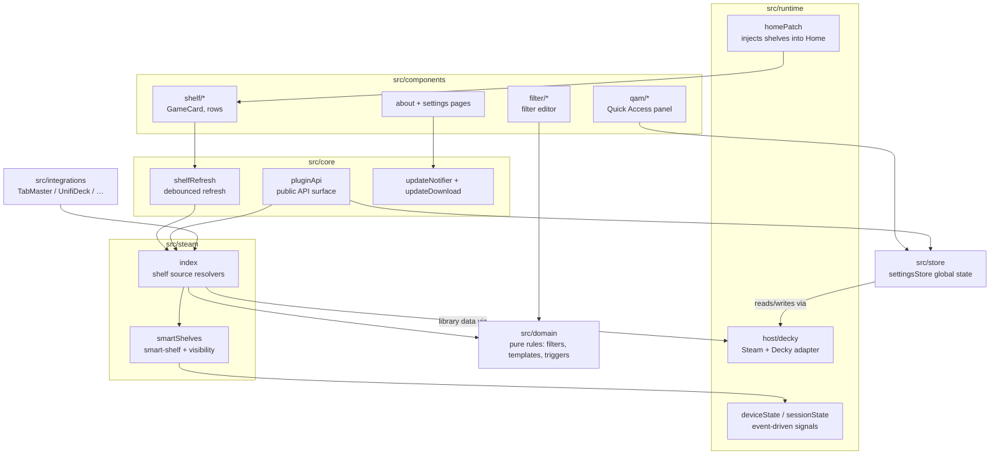

# Components

Inside the frontend container: the main source modules and how work flows from a
Home-screen render down to resolved shelf contents. (C4 Level 3.)

## Notes

- **`src/core`** holds the sensitive logic: `pluginApi` (the public API surface,
  now re-exporting all public types from `@deck-shelves/api`), `shelfRefresh`
  (debounced, single-flight refresh), and the update check / download flow.
- **`src/steam`** resolves what actually goes on a shelf: `index` dispatches
  built-in and external sources; `smartShelves` handles smart-shelf modes and
  visibility rules.
- **`src/domain`** is pure, side-effect-free logic (filters, templates, trigger
  catalogue) — no UI, no external calls.
- **`src/store`** is the single global settings state; **`src/integrations`**
  detects and reads optional companion plugins at runtime.
- **State modules** (`deviceState`, `sessionState`) are event-driven — subscribe,
  cache, notify — with no polling or active timers, matching the performance
  rules for the Deck.
