# Containers

The major runtime pieces of Deck Shelves and how they connect. (C4 Level 2.)

```mermaid
flowchart TB
    subgraph gamepadui["Steam GamepadUI process ~ SharedJSContext"]
        frontend[Frontend<br/>React UI + runtime patches]
        publicapi[Public plugin API<br/>&#64;deck-shelves/api contract]
        hostadapter[Host adapter<br/>&#64;deck-shelves/host contract]
    end

    subgraph deckyproc["Decky Loader"]
        backend[Python backend<br/>main.py RPC methods]
    end

    subgraph disk["Local storage"]
        settings[(Settings JSON<br/>shelves, profiles, filters)]
        downloads[(~/Downloads<br/>update .zip)]
    end

    steam[Steam client APIs]
    net[GitHub / online sources]

    frontend -->|register / read| publicapi
    frontend -->|call capabilities| hostadapter
    hostadapter -->|&#64;decky/ui + &#64;decky/api| steam
    frontend -->|RPC call&#40;&#41;| backend
    backend -->|read / write| settings
    backend -->|download release| downloads
    backend -->|fetch metadata / releases| net
    frontend -->|read library, collections, artwork| steam
```

## Notes

- **Frontend** is the bulk of the plugin: the React UI plus the runtime patches
  that inject shelves into the Home screen. It runs in Steam's `SharedJSContext`.
- **Host adapter** (`src/runtime/host/decky.ts`) is the single seam to Steam /
  Decky: the frontend imports it, never `@decky/*` directly, so a different host
  could implement the same `@deck-shelves/host` contract. Tracked by the
  decoupling metric.
- **Public plugin API** (`@deck-shelves/api`) is the contract external plugins use
  to register sources, filters, sort options, providers and more. It is the
  single source of truth for those public types.
- **Python backend** (`main.py`) owns everything the frontend cannot do itself:
  reading/writing settings JSON, filesystem paths, and outbound network calls
  (online metadata, update check, release download).
