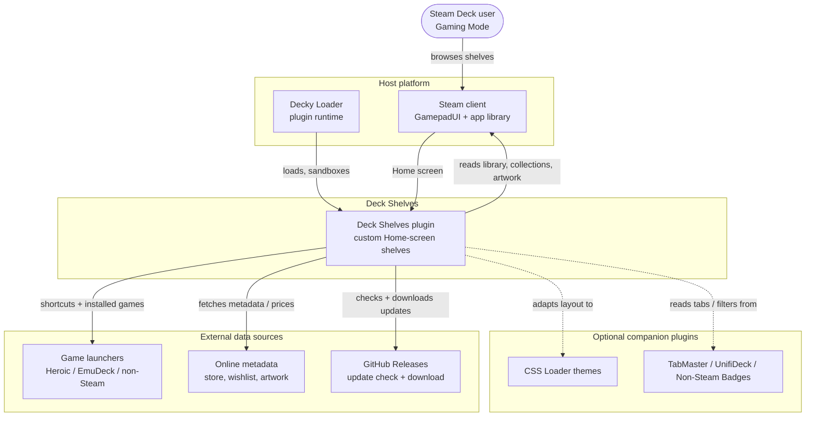

# Context

Deck Shelves in its environment: who uses it and which external systems it
depends on. (C4 Level 1, drawn with Mermaid `flowchart` subgraphs.)

## Notes

- Deck Shelves runs **inside Decky Loader**, which loads and sandboxes it. The
  frontend executes in Steam's GamepadUI (`SharedJSContext`); a small Python
  backend handles filesystem and network access the frontend cannot.
- Everything under **Optional companion plugins** is detected at runtime and used
  only when present — Deck Shelves never hard-depends on them.
- Update checks and downloads go to **GitHub Releases**; the download lands in the
  user's Downloads folder for manual install (there is no auto-install).
