# Filter System

Deck Shelves supports advanced game filtering with AND/OR logic using filter groups.

<p align="center">
  
</p>

## How a shelf resolves

Filters are one stage of the pipeline that turns a shelf's configuration into
the cards on screen. Each stage below is optional except the source:

```mermaid
flowchart LR
    source["Source<br/>collection · tab · filter ·<br/>built-in · wishlist · store"]
    extra["Additional sources<br/>combined as union or intersection"]
    child["Child filter<br/>optional, narrows the pool"]
    group["Filter group<br/>AND / OR over filter items"]
    sort["Sort keys<br/>plus sortReverse"]
    limit["Limit"]
    out(["Shelf contents"])

    source --> extra
    extra --> child
    child --> group
    group --> sort
    sort --> limit
    limit --> out

    classDef src fill:#ede9fe,stroke:#7c3aed,color:#3b2a63
    classDef filt fill:#dbeafe,stroke:#2563eb,color:#12315e
    classDef ord fill:#fef3c7,stroke:#d97706,color:#5c3d0a
    classDef result fill:#dcfce7,stroke:#16a34a,stroke-width:2px,color:#14532d
    class source,extra src
    class child,group filt
    class sort,limit ord
    class out result
```



## Filter Types

| Type | Description | Parameters |
|------|-------------|------------|
| `installed` | Games currently installed | — |
| `favorites` | Games in your favorites | — |
| `nonSteam` | Non-Steam shortcuts (Epic, GOG, etc.) | — |
| `hidden` | Hidden games | `mode`: `"only"` or `"exclude"` |
| `updatePending` | Games with pending updates | — |
| `isNew` | Added to library within 30 days | — |
| `deckCompatibility` | Steam Deck compatibility level | `levels`: `["verified", "playable", "unsupported", "unknown"]` |
| `playedWithinDays` | Played within N days | `days`: number |
| `playtimeRange` | Total playtime in a range | `minHours`: number, `maxHours`: number (either optional) |
| `nameIncludes` | Name contains substring | `text`: string |
| `nameRegex` | Name matches regex | `pattern`: string |
| `collection` | Games in a specific Steam collection | `collectionId`: string |
| `developer` | Filter by developer name | `developers`: string[] |
| `publisher` | Filter by publisher name | `publishers`: string[] |
| `appIdList` | Explicit whitelist of app IDs | `appIds`: number[] |
| `cloudAvailable` | Steam Cloud support | — |
| `controllerSupport` | Native controller support | `min`: number (1 = partial or full, 2 = full only; default 1) |
| `shortcutType` | Filter by entry kind: game (Steam app_type 1 or unknown), software (app_type 2), tool (any other Steam app_type), link (non-Steam shortcut) | `kinds`: `("game" \| "software" \| "tool" \| "link")[]` (default `["game"]`) |
| `merge` | Nested predicate group with its own `and`/`or` mode (per-app boolean) | `mode`: `"and"` \| `"or"`, `items`: FilterItem[] |
| `storeTag` | Has specific Steam store tags _(pass-through, not yet evaluated)_ | `tags`: string[] |
| `achievements` | Achievement count range _(pass-through, not yet evaluated)_ | `min`, `max`: number |
| `friends` | Minimum friends who own _(pass-through, not yet evaluated)_ | `min`: number |

| `recentlyActive` | Played in the current session window | `minMinutes`: number |
| `neglected` | Not played for N days | `days`: number |
| `systemCompatibility` | Runs natively / via compatibility layer | — |
| `remotePlayLocation` | Remote Play availability | `mode`: `"local"` \| `"remote"` \| `"remote-only"` \| `"both"` |
| `appStatus` | Download / update activity | `groups`: `("downloading" \| "queued" \| …)[]` |
| `friendsPlayingNow` | Friends currently in-game _(online)_ | — |
| `friendsPlayedRecently` | Friends played within N days _(online)_ | `days`: number |
| `discount` | Discount percentage range _(online)_ | `minDiscount`, `maxDiscount`: number |
| `priceRange` | Price range _(online)_ | `minPrice`, `maxPrice`: number (either optional) |

> **Note:** `storeTag`, `achievements`, and `friends` are stored and exported correctly but are not yet evaluated at runtime — shelves using only these filters will return all library games.

### Library and metadata

| Type | Description | Parameters |
|------|-------------|------------|
| `genres` | Any of the listed genres | `genres`: string[] |
| `categories` | Any of the listed store categories | `categories`: string[] |
| `franchise` | Franchise name contains | `franchise`: string |
| `vrSupport` | Marked as VR-supported | — |
| `multiplayerType` | Multiplayer capability | `kind`: `"any"` \| `"single"` \| `"multi"` \| `"coop"` \| `"online"` |
| `familySharing` | Flagged for Steam Family Sharing | — |
| `dlcOwned` | Owns at least N DLC | `minCount`: number |
| `soundtrackOwned` | Owns the soundtrack | — |
| `compatDataQuality` | Has any Deck compatibility rating | — |

### Usage and progress

| Type | Description | Parameters |
|------|-------------|------------|
| `launchCount` | Number of launches in a range | `min`, `max`: number (`max` omitted = no upper bound) |
| `avgSessionMinutes` | Average session length in a range | `min`, `max`: number (minutes) |
| `playedOnce` | Played, but no more than N minutes | `maxMinutes`: number |
| `installedNeverPlayed` | Installed with zero playtime | — |
| `neverCompleted` | Achievement completion below 100% | — |
| `achievementPercentRange` | Achievement completion in a range | `min`, `max`: number (0–100) |
| `recentlyAbandoned` | Last played between N and M days ago | `minDaysAgo`, `maxDaysAgo`: number |

### Storage

| Type | Description | Parameters |
|------|-------------|------------|
| `storageDevice` | Installed on internal storage or SD card | `device`: `"ssd"` \| `"sd"` |
| `installedSizeRange` | Installed size in a range | `minMB`, `maxMB`: number (the editor shows GB) |

### Non-Steam shortcuts

| Type | Description | Parameters |
|------|-------------|------------|
| `emuDeckSystem` / `retroDeckSystem` | Shortcut belongs to EmuDeck / RetroDECK | — |
| `heroicLauncher` / `lutrisApp` | Shortcut belongs to Heroic / Lutris | — |
| `chiakiApp` / `moonlightApp` | Remote-play shortcut (Chiaki / Moonlight) | — |
| `hiddenLauncherShortcuts` | Hidden non-Steam shortcut | — |
| `executableType` | Target executable extension | `ext`: string (e.g. `exe`, `sh`) |
| `launchOptionTags` | Launch options contain any tag | `tags`: string[] |
| `customTags` / `parserCategories` | Matches user/parser tags | `tags`: string[] |

### Composite filters

These carry a list of **child filter items** in `children` — any filter type is
allowed, and each child is evaluated through the normal filter evaluator, so you
can nest ranges, name matches and the types above freely.

| Type | Description | Parameters |
|------|-------------|------------|
| `weightedFilter` | Matches when the summed weight of matching children reaches `threshold`. With the default weight of 1 this reads as "at least N of these conditions" | `children`: FilterItem[] (each may carry `weight`: number), `threshold`: number |
| `priorityFilter` | Matches when any child matches (children are checked in order) | `children`: FilterItem[] |
| `exclusionGroup` | Excludes the game when any child matches | `children`: FilterItem[] |

Nesting is depth-capped at runtime, so a self-referential tree cannot loop.

## Filter Groups

Filters can be combined using groups with `AND` or `OR` logic:

```json
{
  "filterGroup": {
    "mode": "and",
    "items": [
      { "type": "installed", "params": {} },
      { "type": "deckCompatibility", "params": { "levels": ["verified", "playable"] } }
    ]
  },
  "sort": "recent"
}
```

Each item can be `inverted` to negate the condition:
```json
{ "type": "installed", "inverted": true, "params": {} }
```

> **Tip:** use `mode: "or"` when you want to surface games that match *any* of several conditions — for example, games by one developer **or** another. Use `mode: "and"` (the default) when every condition must hold simultaneously.

> **Tip:** `inverted` is available on most filter types. Combine it with `mode: "and"` to exclude specific subsets — e.g. installed games that are *not* hidden.

### `merge` — nested predicate groups

`merge` lets a single filter item carry its own sub-group with an
independent `and`/`or` mode, so you can express more complex logic
without restructuring the parent group. It is **not** a list union —
the source pool stays the same and each app is tested once. Mixing a
top-level `and` group with a `merge { or, ... }` child is the usual
shape.

Example: include apps that are installed Steam games **or** any
non-Steam shortcut, in a single shelf:

```json
{
  "filterGroup": {
    "mode": "and",
    "items": [
      {
        "type": "merge",
        "params": {
          "mode": "or",
          "items": [
            { "type": "installed", "params": {} },
            { "type": "nonSteam", "params": {} }
          ]
        }
      }
    ]
  }
}
```

Each `appid` exists exactly once in the source pool, so the result
cannot contain duplicates regardless of how many merge children match
the same app. Cross-platform "same title, different appids" (e.g.
Steam vs. Epic copies) is **not** addressed here — `merge` does not
match by name.

## Sort Options

| Value | Description |
|-------|-------------|
| `alphabetical` | A → Z |
| `recent` | Last played (most recent first) |
| `playtime` | Total playtime (highest first) |
| `release_date` | Release date (newest first) |
| `size_on_disk` | Size on disk (largest first) |
| `metacritic` | Metacritic score (highest first) |
| `review_score` | Steam review score (highest first) |
| `added` | Library acquisition date (newest first) |
| `app_status` | Download / update activity |
| `deck_compat` | Steam Deck compatibility rating |
| `controller_support` | Controller support level |
| `price_low` | Price, lowest first _(online)_ |
| `discount_high` | Discount, highest first _(online)_ |
| `original_price_high` | Original price, highest first _(online)_ |
| `random` | Stable random shuffle, refreshes every 24 h |
| `manual` | User-defined order (`manualOrder`); ids not in the list fall through to `manualBaseSort` |

Usage, progress and storage keys:

| Value | Description |
|-------|-------------|
| `most_launched` / `least_launched` | Number of launches |
| `longest_session` / `shortest_session` | Average session length |
| `most_ignored` | Longest since last played |
| `rediscovered_recently` | Most recently returned to |
| `completion_percent` | Achievement completion (highest first) |
| `closest_to_completion` | Nearest to 100% completion |
| `rarest_achievements` | Rarest achievements owned |
| `newest_installed` / `oldest_installed` | Install date |
| `oldest_unplayed` | Longest-installed with zero playtime |
| `newest_purchased` | Purchase date (newest first) |
| `largest_install` / `smallest_install` | Installed size |
| `ssd_priority` / `sd_priority` | Internal storage or SD card first |
| `friends_playing_now` | Friends currently playing _(online)_ |
| `most_friends_owning` | Most friends who own it _(online)_ |
| `trending_among_friends` | Combined friend activity _(online)_ |

Every key can be inverted with `sortReverse`.

### Multi-key sort

`sort` accepts either a single key (back-compat) or an array of keys for a primary/secondary chain. `sortReverse` mirrors the same shape — a boolean to invert every key, or an aligned `boolean[]` for per-key direction.

```json
{ "sort": ["discount_high", "metacritic"], "sortReverse": [false, false] }
```

The first entry is primary; subsequent entries break ties. Internally a single composite comparator walks each key in order until one returns a non-zero result, then JavaScript's stable sort preserves the established order across passes. Using `Array.sort().reverse()` per key would have inverted tied items and undone the secondary ordering — see `src/test/steam/applySortToIds.test.ts` for the pinned regression case.

`manual` and `random` cannot appear in a multi-key chain (non-deterministic — they wouldn't behave as tiebreakers). The editor only exposes them as the single-key primary choice; the resolver drops them from chained arrays.

Per-key `sortReverse` works for any key the multi-key path supports. When `sort` is an array and `sortReverse` is a boolean, the boolean applies to every key.

## Built-in sources

Besides a collection, library tab or filter, a shelf can draw from a ready-made
source. Pick **Built-in source** in the shelf editor and choose one; it is stored
as `{ "type": "builtin", "sourceId": "<id>" }` and takes no further parameters.

| Group | Sources |
|-------|---------|
| Steam | `dynamic_collections`, `followed_games`, `ignored_games`, `dlc_source`, `soundtrack_source` |
| Manual | `pinned_games`, `history_source`, `session_queue_source`, `temporary_queue_source` |
| Contextual | `recently_updated`, `with_events`, `with_workshop_updates`, `controller_specific_source` |
| Launchers | `emudeck_collections`, `retrodeck_collections`, `heroic_library`, `lutris_library`, `moonlight_sessions`, `chiaki_sessions` |

## Multi-source shelves

A shelf can stack multiple sources and combine their result sets. The editor exposes this implicitly: pick a primary source, then click **+ Add source** to stack extras. Single-source shelves persist their source flat (back-compat); two or more collapse into a `composite` source on save:

```json
{
  "source": {
    "type": "composite",
    "combine": "union",
    "sources": [
      { "type": "collection", "collectionId": "my-favorites" },
      { "type": "wishlist" },
      { "type": "tab", "tab": "installed" }
    ]
  }
}
```

### Combine operators

- `union` — games that appear in **any** child source. The first child's order wins; subsequent children append their items in declaration order, de-duped.
- `intersection` — games that appear in **every** child source. Iteration order follows the first child, so users get a predictable primary ordering.

### Per-shelf exhaustion rules

A single shelf cannot stack two identical sources (e.g. *Collection A* + *Collection A*). The editor enforces this per-shelf via an exhaustion check:

- **filter / wishlist / store** — capped at 1 per shelf. Once one is in the source list, the type disappears from the "+ Add source" dropdown for that shelf.
- **tab / collection** — capped at the total Steam catalog size. Each tab/collection used reduces the available options; once every tab (or collection) is in use on this shelf, the type disappears.
- The same source CAN appear on multiple shelves — exhaustion is per-shelf, not global.

For multi-criteria predicates on a single source, use the [`merge` filter](#merge--nested-predicate-groups) instead of stacking multiple `filter` sources.

### Depth cap

Composite sources may nest (the schema permits it for power users editing JSON directly). The resolver caps recursion at 4 levels deep — beyond that the branch returns an empty result and logs a warning. The editor only exposes one level of nesting.

## Legacy Filter Format

> **Note:** if you are importing shelves from a backup or from TabMaster, the conversion to the group format happens automatically — you do not need to migrate manually.

Older settings may use a flat filter format:
```json
{ "installed": true, "favorites": true, "sort": "alphabetical" }
```

These are automatically converted to the group format at runtime via `legacyFilterToGroup()`.

## Implementation

- Filter evaluation: `src/steam/index.ts` → `evaluateFilterItem()`, `evaluateFilterGroup()`
- Filter UI: `src/components/FilterPanel.tsx`
- Legacy conversion: `src/domain/settings.ts` → `legacyFilterToGroup()`
- Custom filter types: `src/domain/customfilters.ts`
