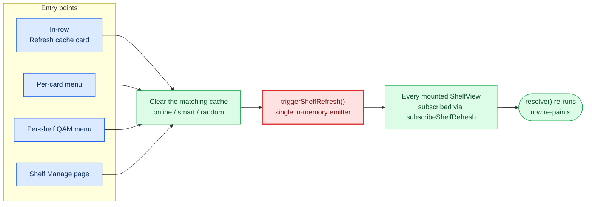

# Online shelves & online features

Reference for the network-backed shelf sources and the caches / refresh
mechanics that support them. Companion to [architecture.md](architecture.md)
(network module) and [filters.md](filters.md) (`discount` filter).

---

## Sources

Two source types are populated from Steam's public store endpoints:

- **`wishlist`** — the signed-in account's wishlist appids.
- **`store`** — sale catalogues (currently the `/specials/` browse).

Both are opt-in: a master toggle (`onlineFeaturesEnabled`) plus per-feature
sub-toggles (`onlineWishlistEnabled`, `onlinePriceSortEnabled`) gate every
network call. With the master toggle off, the resolver never probes the
network and templates that require online features are hidden from the
picker.

Per-shelf flags layered on top:

| Flag | Effect |
|---|---|
| `excludeOwned` | Drop appids already in the local library |
| `excludeOwnedNonSteam` | Extend the owned set to non-Steam shortcuts |
| `hideOwnedNonSteamCloud` | Treat cloud-play catalogue entries as not-owned |
| `childFilter` (FilterGroup) | Additional client-side filter applied on the resolved list |

The "owned" set comes from `getLocalLibraryAppIds()` in `src/steam/index.ts`,
which walks `collectionStore.allGamesCollection` (Steam) and
`collectionStore.myGamesCollection` (Steam + shortcuts) when
`includeNonSteam` is true. Cloud-play shortcuts are identified by
collection membership and dropped from the owned set when
`includeCloudPlay` is false — so Xbox Cloud Gaming entries surfaced via
the Unifideck Microsoft Store integration stay visible on online shelves
by default even with "Include non-Steam shortcuts" on.

---

## Caches

| Key (localStorage) | TTL | Cleared by |
|---|---|---|
| `ds-store-cache-v1` | implicit (cleared by user / install) | `clearOnlineShelfCache()` |
| `ds-wishlist-cache-v1` | implicit | `clearOnlineShelfCache()` |
| `ds-price-cache-v1` | 6 h (per-app `data.fetchedAt`) | `clearOnlineShelfCache()` |
| `ds-game-name-cache-v1` | implicit | `clearOnlineShelfCache()` |
| `ds-shelf-cache-<shelfId>-<sort>-...` | 24 h | per-shelf, cleared on settings change |

The price cache feeds:

- `discountPercent` on the `DeckRowItem` (only on the online card branch
  of `Shelf.tsx` — owned games no longer receive a discount badge).
- `price_low` / `discount_high` / `original_price_high` sort options on
  online shelves.
- The `discount` filter type (when `allowOnlineFilters` is on, i.e.
  inside the child-filter editor for wishlist/store shelves).

The name cache (`ds-game-name-cache-v1`) is sourced from
`fetchGameNames(appids)` in `src/core/onlineStore.ts` and feeds the
"online card" branch in `Shelf.tsx` so wishlist entries not in the local
appStore still render a real title instead of `#appid`.

---

## Refresh flow

Every cache-invalidating action funnels through `triggerShelfRefresh()`
in [src/core/shelfRefresh.ts](../src/core/shelfRefresh.ts) — the single
in-memory emitter every mounted `ShelfView` is subscribed to via
`subscribeShelfRefresh(resolve)`. The four entry points share that path:

| Entry point | Cache cleared | Emitter |
|---|---|---|
| In-row "Refresh cache" card | `clearOnlineShelfCache()` | `triggerShelfRefresh()` |
| Per-card menu → `Deck Shelves > Refresh cache` (online shelves) | `clearOnlineShelfCache()` | `triggerShelfRefresh()` |
| Per-shelf QAM menu → `Refresh cache` | `clearOnlineShelfCache()` (online) / `invalidateSmartShelfCache()` (smart) / `invalidateRandomSortCache()` (random) | `triggerShelfRefresh()` |
| Shelf Manage page → `Refresh cache` | same as above | `triggerShelfRefresh()` |

For non-online shelves the per-card / per-shelf menu only invalidates
that shelf's cache (smart / random); the global emit still fires so the
subscribed shelf's `resolve()` runs and the row re-paints.

`Shelf.tsx`'s meta useEffect **merges** new metadata into the prior
`items` map (instead of replacing it). Cards that survived the refresh
stay visible during the brief gap between the new `appIds` arriving and
the new metadata loading — without the merge, cards with the synthetic
fallback name (`App <id>`) were stripped by the regular-branch
`isStoreFallback && !isOnlineSource` guard and only reappeared on
scroll.

---

## Auth & SteamID derivation

For wishlist source, the resolver needs the account's SteamID64. The
backend tries two strategies in order:

1. **Public API**, with SteamID64 derived from the local userdata
   directory listing (no cookie, no login required for public
   profiles). Implementation: `_get_steam_id64` in
   [main.py](../main.py).
2. **Cookie JWT** read from Steam's local Chromium cookie store,
   AES-128-CBC decrypted via `openssl`. Implementation:
   `_get_steam_cookie`.

Both lookups consult `_steam_install_candidates()` which centralises the
Steam install root discovery — adding a new platform / Flatpak variant
is a one-liner in that helper. The cookie path appends
`config/htmlcache/Default/Cookies` to each root; the userdata path
appends `userdata`. The first existing match wins.

Platforms currently covered:

| Platform | Roots searched |
|---|---|
| Linux | `~/.local/share/Steam`, `~/.steam/steam`, `~/.var/app/com.valvesoftware.Steam/.local/share/Steam`, `~/.var/app/com.valvesoftware.Steam/data/Steam` |
| Windows | `%ProgramFiles(x86)%/Steam`, `%ProgramFiles%/Steam`, `%ProgramW6432%/Steam`, `%LOCALAPPDATA%/Steam`, `%APPDATA%/Steam` |
| macOS | `~/Library/Application Support/Steam` |

The cookie decryption shells out to `openssl` (POSIX-standard). On
Windows hosts without `openssl` on `PATH` the subprocess fails and the
caller falls through gracefully — the public-API path via userdata
still resolves the SteamID, so wishlist still works.

---

## Privacy posture

- Master toggle off → zero network probes (including connectivity
  checks).
- Connectivity check (`src/core/connectivity.ts`) fires only before a
  store fetch.
- Wishlist sync: once per day, results cached in `localStorage`.
- Price fetch: cached 6 h per appid, only when actually needed by a
  visible shelf.
- Cookie reads are confined to the user's Steam profile under the
  matched install root; nothing is uploaded.
- No third-party services contacted. URLs surfaced to the user in the
  privacy disclosure (`online_privacy_body` i18n key) match what the
  resolver actually contacts.
