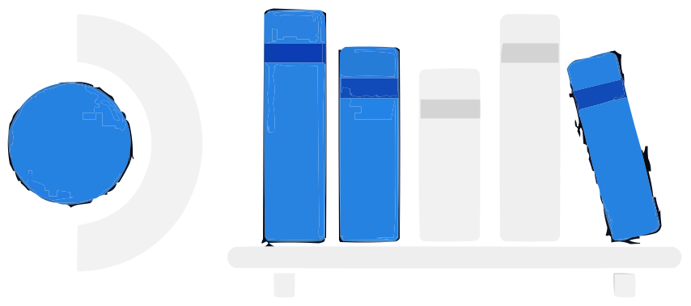
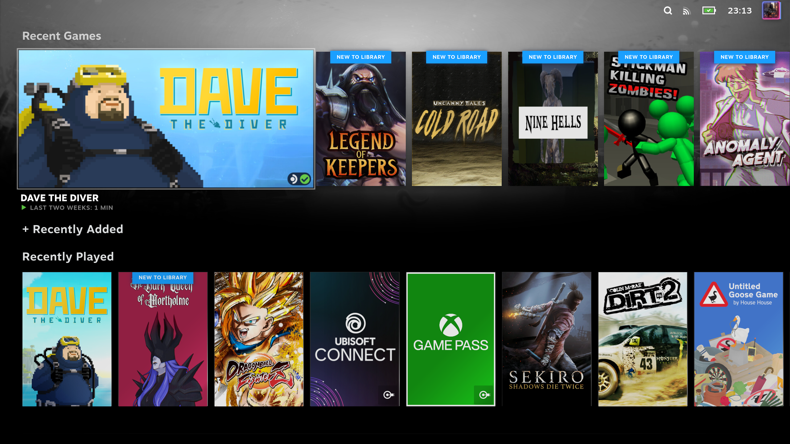

# Deck Shelves

*[Read in English](../../README.md)*

<div align="center">
<p>
  
</p>

[](https://github.com/santojon/Deck-Shelves/actions/workflows/ci.yml)
[](https://github.com/santojon/Deck-Shelves/actions/workflows/release.yml)
[](../../src/test/)
[](../../src/test/test_main.py)
[](../../tsconfig.json)
[](../../scripts/build/validate-compat.mjs)
[](https://github.com/ValveSoftware/SteamOS)
[](https://github.com/santojon/Deck-Shelves/releases/latest)
[](https://github.com/santojon/ShelvesHub/releases/latest)
[](https://github.com/santojon/Deck-Shelves/releases/latest)
[](https://plugins.deckbrew.xyz/plugins)
[](https://www.npmjs.com/package/@deck-prateleiras/api)
[](https://www.npmjs.com/package/@deck-prateleiras/host)
[](https://github.com/santojon/Deck-Shelves/network/members)
[](https://github.com/santojon/Deck-Shelves/graphs/traffic)

[](https://discord.gg/EChuVEDakk)
[](https://www.reddit.com/r/DeckShelves/)
[](https://github.com/sponsors/santojon)
[](https://ko-fi.com/santojon)

</div>

**Deck Shelves** é um plugin que deixa a tela inicial do Steam Deck do seu jeito. Monte prateleiras personalizadas a partir das suas coleções, abas da biblioteca ou filtros; deixe as **prateleiras inteligentes** trazerem jogos automaticamente quando eles forem relevantes; adicione hero art, cards de decoração e linhas online de wishlist/loja — tudo configurado direto no Deck através de um editor no Quick Access Menu embutido. Sem modo desktop, sem arquivos de configuração.

**Novo por aqui?** Leia o [guia de primeiros passos](https://github.com/santojon/Deck-Shelves/discussions/48) e depois instale via [ShelvesHub](https://github.com/santojon/ShelvesHub) (recomendado — não exige Decky Loader) ou pela Decky Store (veja [Instalação](#instalação)). Dúvidas ou ideias? Entre no [Discord](https://discord.gg/EChuVEDakk) ou no [r/DeckShelves](https://www.reddit.com/r/DeckShelves/).

## Conteúdo

- [Deck Shelves](#deck-shelves)
  - [Conteúdo](#conteúdo)
  - [Funcionalidades](#funcionalidades)
  - [Capturas de tela](#capturas-de-tela)
  - [Instalação](#instalação)
    - [Via ShelvesHub (recomendado)](#via-shelveshub-recomendado)
    - [Pela Decky Store](#pela-decky-store)
    - [Instalação manual](#instalação-manual)
    - [Instalar a partir de URL](#instalar-a-partir-de-url)
  - [Documentação](#documentação)
  - [Desenvolvimento](#desenvolvimento)
  - [Arquitetura](#arquitetura)
  - [Compatibilidade](#compatibilidade)
    - [Sistemas operacionais](#sistemas-operacionais)
    - [Ambientes validados](#ambientes-validados)
  - [Ferramentas de desenvolvimento](#ferramentas-de-desenvolvimento)
  - [Contribuindo](#contribuindo)
  - [Licença](#licença)
  - [Sobre](#sobre)

## Funcionalidades

- Injeta prateleiras personalizadas em `library/home`
- Prateleiras alimentadas por **coleções**, **abas da biblioteca** ou **filtros personalizados**
- **Múltiplas fontes por prateleira** — empilhe coleções + abas + wishlist + loja em uma única prateleira via União (jogos em qualquer fonte) ou Interseção (jogos em todas as fontes). A fonte de filtro continua exclusiva; use o `merge` de filtro para predicados com múltiplos critérios. Quando qualquer filho é wishlist ou loja, uma aba **Filtros online** no editor aplica predicados exclusivos de online (desconto, atividade de amigos) sobre o resultado combinado.
- **Cards de decoração** — fixe cards de posição fixa em qualquer lugar de uma prateleira: rótulo de texto, banner de imagem, atalho de URL focável ou um espaço transparente. Novos cards entram no slot em foco na prévia e herdam a ordem atual da linha via ordenação manual. Cards de imagem suportam **hero art** opcional (funciona como plano de fundo do hero por prateleira ao focar) e um **modo de sombra** (Nunca / Ao focar / Sempre) para enquadramento limpo de PNGs transparentes.
- **Adicionar rápido à prateleira** — o menu de contexto de todo jogo (nas prateleiras do DS E na biblioteca nativa) exibe "Adicionar à prateleira" apenas com as prateleiras elegíveis (pula prateleiras no limite, o teto de 50 entradas, ou que já contêm o jogo).
- **Alternância de destaque pelo botão Y** — foque um jogo, pressione Y para alternar o destaque por card sem abrir o menu de contexto.
- **Grupos de filtro avançados** com lógica AND/OR para consultas complexas de jogos
- Filtre jogos por:
  - Favoritos, instalados, ocultos, não-Steam
  - **Tipo de atalho** — 15 tipos cobrindo Jogos, Softwares, Ferramentas, Demos, DLC, Música/Trilhas sonoras, Vídeos, Quadrinhos, Guias, Drivers, Configurações, Hardware, Betas, Aplicativos e links Não-Steam
  - **Status do app** — 14 opções para Em execução, Iniciando, Instalando, Validando, Baixando (composto + granular), Na fila, Pausado, Reconfigurando, Preparando, Aplicando, Não instalado, Instalado (ocioso)
  - Nome (substring ou regex)
  - Nível de compatibilidade com o Deck
  - Faixa de tempo de jogo (mín. / máx. minutos)
  - Jogado nos últimos N dias
  - Atualização pendente
  - Tags da loja, contagem de conquistas, amigos que possuem
  - **Amigos jogando agora** — corresponde a jogos que pelo menos um amigo da Steam está jogando neste momento (requer funcionalidades online)
  - **Amigos jogaram recentemente** — corresponde a jogos que qualquer amigo da Steam jogou nos últimos N dias (1–30, padrão 14; requer funcionalidades online)
  - **Faixa de desconto** — corresponde a jogos cujo desconto na loja Steam está numa faixa de % mín/máx escolhida (requer funcionalidades online)
  - **Faixa de preço** — corresponde a jogos cujo preço na loja Steam está numa faixa mín/máx escolhida, na sua própria moeda da loja (requer funcionalidades online)
  - **Local do Remote Play** — corresponde pelo local onde um jogo está instalado: localmente, em outro dispositivo, somente remoto, ou ambos — alimenta uma prateleira "jogar de outro Deck / PC"
  - **Compatibilidade de sistema** — mantém apenas os jogos disponíveis na plataforma que você está usando no momento
  - **Ativo recentemente** — jogos que você jogou nas últimas duas semanas (sua rotação atual)
  - **Negligenciado** — jogos que você já jogou mas não abre há N dias
- Ordene prateleiras alfabeticamente, por jogo recente, tempo total de jogo, data de lançamento, tamanho em disco, nota do Metacritic, nota de avaliações, % de desconto, preço, preço original — cada direção (asc / desc) alternável por prateleira via um botão de ícone ao lado do menu de ordenação
- **Ordenação por múltiplas chaves** — encadeie uma ordenação primária com um ou mais critérios de desempate (ex.: *maior desconto → nota do metacritic* desfaz empates entre jogos com o mesmo desconto). Cada linha tem seu próprio alternador asc/desc. Cadeia estável — chaves secundárias só entram em ação quando a primária realmente empata.
- A seleção de abas da biblioteca mostra suas abas reais em tempo de execução, incluindo as criadas por outros plugins
- **Dimensionamento dinâmico de cards** — prateleiras combinam com as dimensões nativas dos cards e com os temas
- **Destacar primeiro jogo** — o primeiro card é renderizado como um card em destaque no formato paisagem
- **Destacar todos os jogos** — alterne por prateleira ou globalmente para renderizar todo card como um card em destaque no formato paisagem
- **Ocultar linha de status** — alterne para ocultar o status de jogo/instalação de um jogo
- **Ocultar cards finais** — alternâncias separadas por prateleira e globais para ocultar o tile "Ver mais" e/ou o tile "Atualizar" em prateleiras que os emitem (prateleiras normais com ordenação aleatória e prateleiras inteligentes atualizáveis). O tile "Ver mais" também se oculta sozinho quando uma prateleira já mostra todo jogo que corresponde, então ele só aparece quando realmente há mais para ver
- **Tamanho por prateleira** — o slider de limite vai até 50 cards nos editores de prateleira e prateleira inteligente
- **Sub-filtros para fontes de coleção e aba** — quando a fonte de uma prateleira é uma coleção ou aba da biblioteca, uma aba Filtros Adicionais no editor permite adicionar mais critérios de filtro em cima da fonte
- **Ocultar jogos manualmente por prateleira** — a alternância "Ocultar jogos específicos" na aba Exibição abre um seletor de mini-cards; a prateleira busca automaticamente candidatos extras para manter preenchido o número configurado de cards visíveis
- **Deduplicar por nome** — alternância por prateleira e global que colapsa entradas que compartilham um nome exato (Steam vence sobre não-Steam)
- **Ocultar jogos recentes** — alternância para ocultar a seção nativa "Jogados recentemente"
- **Usar primeira prateleira como recentes (experimental)** — quando "Ocultar jogos recentes" está ativo, injeta os jogos da primeira prateleira no componente nativo de recentes em vez de ocultá-lo; reutiliza o DOM/CSS/animações nativos para compatibilidade total com temas do CSS Loader; desativa-se automaticamente com um banner em caso de falha
- **Ocultar abas da home** — alternância para ocultar a barra nativa de abas da home na parte inferior das prateleiras
- **Hero art de fundo** — ative por prateleira (normal ou smart) na aba Visual do editor, ou globalmente para todas as prateleiras de uma vez; a arte de fundo do jogo em foco aparece atrás daquela prateleira, acompanhando-a onde quer que ela esteja — funciona com ou sem ocultar a linha nativa de recentes
- **Forçar temas do CSS Loader** — promove toda prateleira para o espaço de seletores estilo-nativo-de-recentes para que temas como ArtHero apliquem consistentemente em todas as prateleiras (só aparece quando o CSS Loader está instalado)
- **Filtro por Desenvolvedor / Publisher** — filtre jogos por desenvolvedor ou publisher com descoberta automática em lote
- **Filtro de lista de App ID** — coloque na whitelist um conjunto explícito de app IDs para fixar jogos específicos numa prateleira
- **Suporte a mouse/hover** — cards mostram rótulos e brilho ao passar o mouse, igual ao foco do controle
- **Sobreposições de janela de horário por dia para prateleiras inteligentes** — uma alternância de Filtros Smart abre uma aba dedicada de Sobreposições onde cada dia da semana pode ter suas próprias faixas de horário, além das horas padrão em nível de prateleira e do filtro de dias
- **Regras avançadas de visibilidade** — mostre uma prateleira (normal, smart ou filtro salvo) somente quando condições personalizadas forem atendidas, combinadas com **corresponder qualquer uma** ou **corresponder todas** (presets Noites / Fins de semana):
  - **Horário** — janelas de hora do dia e dia da semana, fim de semana vs. dia útil, parte do dia (manhã / tarde / noite / madrugada), estação do ano (sensível ao hemisfério), e suas próprias faixas de datas de feriado
  - **Dispositivo** — bateria baixa, carregando, offline, encaixado (dock) / tela externa, resolução mínima de tela, ultrawide
  - **Sessão** — se o último jogo que você jogou foi Steam ou não-Steam, ou se um jogo está em execução no momento
  - **Desempenho** — CPU alta, memória baixa, ou taxa de quadros baixa — lidos sob demanda apenas quando uma prateleira realmente os usa (sem polling em segundo plano)

  Totalmente compatível com as janelas de hora / dia já existentes; as condições são reavaliadas em eventos de hardware / sessão (sem polling) e degradam graciosamente fora do SteamOS
- **Prateleiras com auto-pin e auto-colapso** — dê a qualquer prateleira (normal ou smart, pela aba Exibição do editor) o mesmo tipo de árvore de condições para **fixar automaticamente** no topo da home enquanto a condição se mantiver (reverte quando ela deixa de valer), ou **colapsar automaticamente** para apenas o cabeçalho quando uma condição corresponder ou a prateleira estiver vazia. Ambos são opcionais; uma home sem nenhum dos dois configurado permanece inalterada
- **Prévia da prateleira ao vivo no editor** — a área de prévia mostra cards reais como aparecem na home (título, nome, linha de status, selos de compatibilidade / novo / não-Steam, tiles Ver mais / Atualizar) e reflete em tempo real toda alternância da aba Exibição
- **Prateleiras Inteligentes** — mais de 30 tipos de prateleira orientados por heurística que aparecem automaticamente quando as condições são atendidas e desaparecem quando nenhum jogo corresponde. Focadas em jogos: Escolha do Dia, Escolhas para o Deck, No Deck, Jogados Recentemente, Sessões Longas, Roleta, Não Iniciados, Melhores Não Jogados, Jogo Rápido, Interrompidos, Não-Steam, Tempo Livre, Hora do Dia, Redescobrir, Esquecidos. Templates heurísticos: Resgate de Backlog, Joias Esquecidas, Joias Escondidas, Modo Viagem, Clássicos Nunca Tocados, Instalações Recentes Ocultas, Rotação Semanal, Destaque Mensal, Rotação Sazonal (cada um com controles ajustáveis de cooldown / obsolescência / nota mínima / rotação). Focadas em mídia: Trilhas Sonoras, Vídeos, Demos, Jogos na Nuvem. Sensíveis ao runtime (melhor esforço em relação aos dados de runtime da Steam): Modo Bateria Baixa, Quase Terminado, Jogo no Sofá, Pronto para Co-op, Jogos em Grupo. Dependentes de online: Amigos Jogando. Ordenadas por probabilidade de resultados no seletor
- **Templates de prateleira inteligente salvos** — persista uma configuração de prateleira inteligente totalmente ajustada e reutilize-a a partir do seletor de templates; exposto a plugins via a API pública
- **Me Surpreenda** — sub-alternância que oculta a lista manual de prateleiras inteligentes e deixa o sistema escolher de 1 a 5 templates automaticamente todo dia; slider de contagem configurável (0 = o sistema decide)
- **Templates de prateleira** — 11 presets (Favoritos, Jogados Recentemente, Instalados, Mais Jogados, Adicionados Recentemente, Aguardando Atualização, Não-Steam, Sessões Longas, Steam Cloud, Verificado para Deck, Melhor Avaliados) num seletor em grade de 2 colunas. Escolher qualquer template — Em branco, preset normal, preset smart, ou Personalizado — abre primeiro o modal de edição; **nada é persistido até você apertar Salvar**, então cancelar descarta o rascunho de forma limpa.
- **Overlay de Busca Rápida** — L1+R1 num card abre uma pílula de busca translúcida centralizada que faz correspondência aproximada (fuzzy) com todo jogo nas suas prateleiras visíveis (cobre cards abaixo da dobra e itens ainda carregando metadados). A normalização NFD trata diacríticos (ex.: café ⇄ cafe). Após uma breve pausa, o melhor resultado é rolado até a tela e recebe o foco. Duas alternâncias: "Abrir teclado virtual" (ativado por padrão, controla o pop-up automático) e "Buscar apenas ao pressionar Enter" (desativado por padrão, troca o debounce por um fluxo de acionamento explícito). L1, R1 ou B fecha o overlay, esteja o foco num teclado físico ou virtual.
- **Overlay de Navegação Lateral** — L1 duas vezes em qualquer card desliza um painel esquerdo listando toda prateleira visível na ordem em que são renderizadas na home (usa `order` do CSS para uma ordem visual precisa). A barra da borda esquerda com o tema da Steam marca a linha em foco; o painel foca automaticamente a prateleira de onde você veio, não a primeira. R1+L1 / B / dpad-direita fecham o painel; selecionar uma linha pula o foco para o primeiro card daquela prateleira. Plugins podem contribuir linhas extras via a API pública.
- **Página de Configurações dedicada** — aberta pelo ícone de engrenagem na barra de título do QAM: uma rota de página inteira com sete abas (Configurações rápidas, Prateleiras, Perfis, Integrações, Atalhos, Backup, Ferramentas avançadas) apoiada pelas mesmas ações do QAM e do sidecar
- **Versão em todo lugar + informações de sistema mais completas** — a versão exata do plugin aparece num rodapé padrão em toda página de configurações e no QAM (útil para relatos de bug); Avançado → Informações do sistema lista os nomes reais dos seus temas ativos do CSS Loader e a contagem de instalados em vez de uma heurística
- **Perfis de uso** — salve a configuração (toda alternância, filtro salvo e — se você marcar **Vincular prateleiras ao perfil** — suas prateleiras) como um perfil nomeado, troque com um toque, importe/exporte em JSON. Um perfil **Padrão** restaura as configurações de fábrica mantendo o plugin ativo; ele só limpa suas prateleiras se você optar por isso
- **Gatilhos de troca automática de perfil** — dê a um perfil salvo um gatilho (as mesmas condições de visibilidade acima) e ative a **troca automática** para que ele se aplique sozinho quando o gatilho corresponder — um perfil *Encaixado* quando você encaixa o Deck, um perfil *Economia de bateria* quando a bateria fica baixa. Cada perfil define seus próprios gatilhos; a alternância mestre fica no QAM, no sidecar e em Configurações → Perfis, e os gatilhos vão e voltam pela exportação/importação e pelo resumo de Informações do sistema
- **Atalhos de botão personalizáveis** — remapeie ou desative os gatilhos do controle para ocultar/destacar/iniciar rápido, e remapeie as combinações para Busca Rápida e Navegação Lateral. Entradas simples, em combinação e de toque duplo são suportadas, incluindo botões traseiros e de clique do analógico (`L3` / `R3` / `L4` / `R4` / `L5` / `R5`); botões reservados do sistema são rejeitados
- **Atalhos de teclado independentes** — todo atalho de botão acima também tem sua própria tecla de teclado, vinculável junto com a combinação do controle — qualquer uma das entradas dispara a mesma ação, nenhuma substitui a outra. Mesma gramática de simples/combinação/toque duplo, além de combinações com modificador (ex.: `Ctrl+F`); ignorado enquanto um campo de texto está em foco
- **Lista unificada de prateleiras + reordenar por arrastar-e-soltar** — opte por mesclar prateleiras normais e smart numa única lista ordenada e arraste as linhas diretamente no painel Prateleiras (os botões `↑` / `↓` do controle continuam como alternativa)
- **Descoberta de launchers externos** — jogos do EmuDeck, RetroDECK, Heroic, Lutris, Moonlight e Chiaki aparecem através de fontes de prateleira dedicadas; somente leitura, atualizado a cada 15 minutos em segundo plano
- **Painel de Integrações** — todo descritor registrado (nativo ou de terceiros) ganha um ativar/desativar por linha; entradas nativas trazem um selo verde NATIVO
- **Modos de exibição — Normal / Leve / Avançado** — *Leve* oferece uma experiência mínima: a home descarta logo / ícone / descrição / hero por prateleira e desativa a busca por contexto + navegação lateral, e seus controles agora inativos ficam ocultos do QAM/sidecar; *Avançado* desbloqueia a aba de ferramentas avançadas (log verboso, logs de diagnóstico no dispositivo, atalhos de reset) e Integrações sempre ativas; *Normal* é o padrão. Leve e Avançado são mutuamente exclusivos e armazenados por perfil. Matriz completa em [docs/display-modes.md](../display-modes.md)
- **Artes personalizadas atualizam ao voltar para a home** — troque uma capsule / logo / hero / ícone em outro lugar, aperte B para voltar, e o novo bitmap aparece na linha sem recarregar o plugin
- Reordene e alterne a visibilidade de prateleiras pelo QAM
- **Fontes de prateleira online (opcionais)** — prateleiras de wishlist e Loja Steam com ordenações `price_low`, `discount_high`, `original_price_high`; quatro templates prontos (Wishlist, Wishlist em promoção, Wishlist grátis, Grátis agora); armazenadas em cache local para que a home continue funcionando offline
- **Excluir jogos que você já possui** — alternância por prateleira nas fontes de wishlist/loja que oculta qualquer jogo cujo appid ou nome exato corresponda a um título na sua biblioteca local; sub-alternância para atalhos não-Steam (de outras lojas), e uma sub-alternância adicional para stubs de catálogo de jogo na nuvem (serviços de cloud gaming expostos via Unifideck) para que promoções no catálogo de nuvem ainda apareçam
- **Selos de desconto** — cards em prateleiras online mostram um selo verde "% off" (espelha o slot do selo NOVO, exibido até em cards de placeholder enquanto a arte ainda está carregando)
- **Ação de atualizar em todo lugar** — "Atualizar cache" / "Atualizar" sensível ao contexto, disponível no menu de ações do QAM, no menu de contexto do card da prateleira, e no tile final de atualização
- **Aba própria no Quick Access (experimental, opcional)** — coloca o Deck Shelves na própria faixa de abas do Quick Access, ao lado de Notificações e Configurações, em vez de só dentro da lista de plugins do Decky. Desativado por padrão; reinicie a Steam após ativar
- **Modo Vitrine (opcional)** — enquanto ocioso na Home, percorre lentamente suas prateleiras como um protetor de tela; qualquer entrada o interrompe instantaneamente. Atraso configurável, tempo por prateleira, e ordem aleatória
- **Protetor de tela (opcional, experimental)** — uma apresentação de slides em tela cheia de tudo que sua tela inicial mostra, opcionalmente misturando suas próprias capturas de tela locais também, no lugar do protetor de tela nativo. Seu próprio atraso de início e tempo por imagem, além de uma sobreposição opcional do logo do jogo que você pode redimensionar e reposicionar para qualquer canto
- **Sincronização de configurações entre dispositivos (opcional, experimental)** — mantenha prateleiras, filtros, perfis e todas as outras preferências sincronizadas entre todos os dispositivos da mesma conta Steam, usando o armazenamento em nuvem dessa própria conta — sem login extra, sem custo. O **perfil ativo no momento é local por dispositivo** (manual ou por gatilho): um perfil *Vitrine* que ativa numa máquina ao encaixar nunca vira um dispositivo portátil na mesma conta para esse perfil — cada dispositivo mantém seu próprio perfil atual enquanto as configurações subjacentes e a lista de perfis continuam sincronizando
- Importe/exporte todas as prateleiras e a configuração de prateleira inteligente como JSON
- Configurações persistentes entre reinstalações do plugin
- Proteção contra falhas com nova tentativa automática
- Suporte a múltiplos idiomas (EN, EN-GB, PT-BR, PT-PT, FR, FR-CA, DE, ES, ES-419, IT, RU, PL, NL, TR, UK, JA, KO, ZH-CN, ZH-TW)

## Capturas de tela

<p align="center">
  
</p>

Um tour visual completo — home, QAM, editor de prateleira, prateleiras inteligentes, docs do About e mais — está em **[docs/showcase.md](showcase.md)**.

## Instalação

### Via ShelvesHub (recomendado)

[ShelvesHub](https://github.com/santojon/ShelvesHub) é um host independente — ele injeta o Deck Shelves diretamente e não precisa de nenhum loader de plugin. Instaladores de um clique para cada plataforma, atualizações automáticas para ele mesmo e para o plugin, e sua própria aba no Quick Access Menu.

1. Pegue o instalador para a sua plataforma na [página de releases do ShelvesHub](https://github.com/santojon/ShelvesHub/releases/latest) (ou veja o [site do ShelvesHub](https://santojon.github.io/ShelvesHub/) para detalhes).
2. Execute-o — no Steam Deck é um arquivo `.desktop`, sem necessidade de sudo.
3. Reinicie a Steam se for solicitado. O Deck Shelves ganha sua própria aba no Quick Access Menu automaticamente.

Já usa o Decky Loader? O ShelvesHub coexiste com ele — os dois podem ser instalados ao mesmo tempo, compartilhando as mesmas configurações.

### Pela Decky Store

1. Instale o [Decky Loader](https://decky.xyz) no seu sistema
2. Abra a Decky Store e procure por **Deck Shelves**
3. Instale e reinicie a Steam se for solicitado

### Instalação manual

1. Baixe o `deck-shelves-v*.zip` mais recente na [página de Releases](https://github.com/santojon/Deck-Shelves/releases/latest)
2. No modo de jogo, vá até a página de configuração do Decky -> Desenvolvedor -> Instalar a partir de arquivo zip
3. Selecione o zip baixado e confirme
4. Reinicie a Steam se for solicitado

### Instalar a partir de URL

Uma opção do modo desenvolvedor do Decky — funciona, mas é menos confiável que o zip acima, já que o Decky deriva o nome do plugin a partir da própria URL em vez do arquivo. Prefira a Instalação manual a menos que você precise especificamente disso.

1. No modo de jogo, vá até a página de configuração do Decky -> Geral -> ative o Modo desenvolvedor
2. Vá até a nova aba Desenvolvedor -> Instalar a partir de URL
3. Cole o link `deck-shelves-v*.zip` da [página de Releases](https://github.com/santojon/Deck-Shelves/releases/latest) e confirme

## Documentação

Tudo está em **[docs/](docs-index.md)** — comece por lá para o índice completo.

- [Capturas de tela / showcase](showcase.md) — tour visual completo de todas as telas
- [Arquitetura](architecture.md) — visão geral do sistema, estrutura do projeto, fluxo de dados, sistemas-chave, internals da Home
- [Plugin API](plugin-api.md) — registre fontes de prateleira personalizadas a partir de outros plugins
- [Sistema de filtros](filters.md) — tipos de filtro, grupos, chaves de ordenação, fontes nativas
- [Templates de prateleira](shelf-templates.md) — presets de templates de prateleira padrão e online
- [Prateleiras Inteligentes](smart-shelves.md) — templates de prateleira inteligente, critérios e confiabilidade
- [Prateleiras online](online-shelves.md) — fontes baseadas em rede, cache e atualização
- [Modos de exibição](display-modes.md) — o que Normal / Leve / Avançado mostram e ocultam
- [Guia de desenvolvimento](development.md) — setup, comandos de build, testes, convenções
- [Webpack Classmap](webpack-classmap.md) — descoberta de classes CSS em tempo de execução
- [Auditoria de performance](performance.md) — metodologia de medição, caminhos críticos, ganhos aplicados
- [Manual de QA](qa-manual.md) — checklist de regressão manual + referência de flags do harness de QA
- [Inspeção de dispositivo](cdp.md) — inspecionando o plugin em execução num dispositivo

## Desenvolvimento

Setup, variáveis de ambiente, comandos de build/deploy/empacotamento, testes,
captura de screenshots, a suíte local de testes de UI, fluxos de validação, o
bench de performance, e diagnósticos via CDP estão todos no
**[Guia de Desenvolvimento](development.md)**.

## Arquitetura

Estrutura de diretórios, fluxo de dados, sistemas-chave, e os internals da
injeção na Home (substituição de recentes, reparent da árvore de navegação por
foco, promoção da primeira prateleira) estão documentados em
**[docs/architecture.md](architecture.md)**.

## Compatibilidade

Todas as verificações podem ser executadas multiplataforma (Linux / macOS / Windows) via o wrapper do Node, que localiza o `bash` automaticamente (Git Bash / WSL no Windows):

```bash
pnpm run validate:compat        # node wrapper — funciona em qualquer lugar
# ou diretamente em shells Unix:
bash scripts/build/validate-compat.sh
```

### Sistemas operacionais

O Deck Shelves roda de duas formas: de forma independente via **[ShelvesHub](https://github.com/santojon/ShelvesHub)** (instalador próprio por sistema operacional, sem precisar de plugin loader) ou como plugin sob o **Decky Loader**, que se instala como um serviço systemd e é exclusivo de Linux no nível do sistema operacional. O mesmo pacote do plugin roda sem alterações sob qualquer um dos dois hosts. A descoberta de caminhos ([`src/backend/paths.py`](../../src/backend/paths.py)) e o empacotamento ([`scripts/build/package.py`](../../scripts/build/package.py)) são agnósticos ao sistema operacional (só stdlib, sem CLI de bash/`zip`).

| SO | Via ShelvesHub | Via Decky Loader |
|---|---|---|
| SteamOS / Steam Deck | ✅ oficial (alvo principal) — x86_64 e ARM64 | ✅ oficial (alvo principal) |
| Linux — similares a SteamOS (Bazzite, ChimeraOS, HoloISO, Nobara) + desktop (nativo / Flatpak) | ✅ x86_64 e ARM64, com instalador de um clique ou pacote | ✅ não-oficial — a instalação via systemd do Decky funciona |
| Windows | ✅ estável, com instalador de um clique | ⚠️ não-oficial — via um instalador comunitário para Windows; instável |
| macOS | ✅ binário universal — nativo em Apple Silicon e Intel | ❌ sem suporte — sem systemd / sem porta remota de debug |

> O Decky Loader suporta oficialmente **apenas SteamOS / Steam Deck**; seu suporte a Linux desktop e Windows é mantido pela comunidade e pode quebrar, e ele não alcança o macOS de forma alguma. O [ShelvesHub](https://github.com/santojon/ShelvesHub) cobre essas lacunas com instaladores próprios para cada plataforma — veja [Instalação](#instalação).

### Ambientes validados

A suíte de compatibilidade valida a toolchain de build (Vite/ESM, TypeScript/Node), Decky Loader 3.x (API v1) + publicação na Decky Store, SteamOS 3.5–3.9 (incl. GamepadUI), i18n, e o backend em Python — veja o selo [`scripts/build/validate-compat.mjs`](../../scripts/build/validate-compat.mjs) e rode `pnpm run validate:compat` para reproduzir.

## Ferramentas de desenvolvimento

O projeto inclui diagnósticos baseados em CDP e automação de screenshots para desenvolvimento no Steam Deck. Veja [deckprobe/README.md](../../deckprobe/README.md) para detalhes sobre:

- **CDP probe** — verificações de runtime mount, linhas e smoke-test
- **Diagnósticos do Deck** — wrapper de diagnóstico baseado em SSH
- **Captura de screenshots** — captura automatizada de screenshots via CDP para a documentação

## Contribuindo

[](https://github.com/santojon/Deck-Shelves/issues)

Veja [CONTRIBUTING.md](../../CONTRIBUTING.md) para diretrizes de desenvolvimento, estilo de código e como enviar mudanças.

## Licença

Este projeto é licenciado sob a licença BSD 3-Clause. Veja [LICENSE](../../LICENSE) para detalhes.

## Sobre

O Deck Shelves é desenvolvido por [Jonathan Santos](https://github.com/santojon).

[](https://ko-fi.com/santojon)
