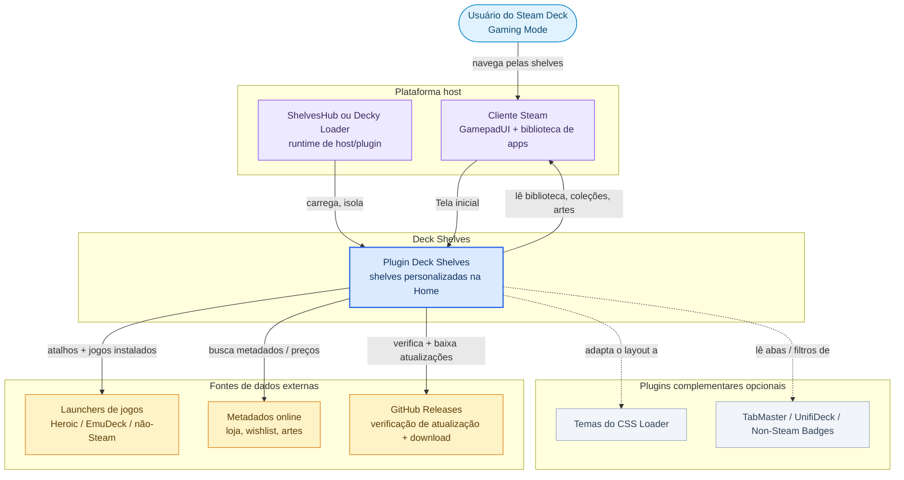
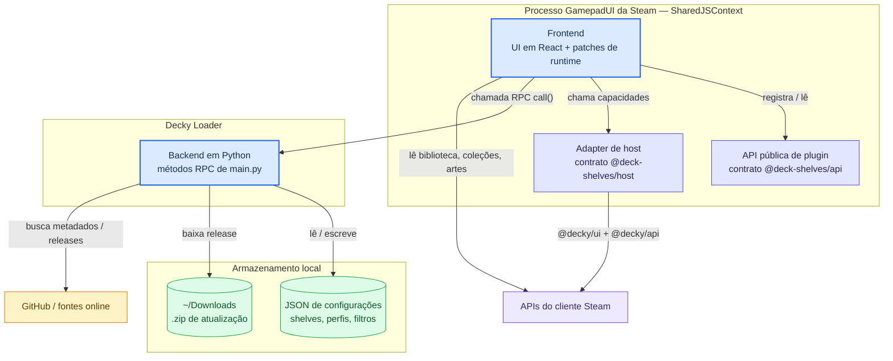
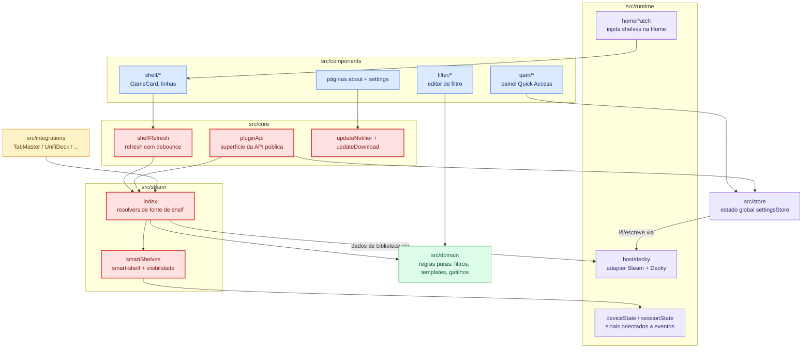

# Arquitetura

*[Read in English](../architecture.md)*

Deck Shelves é um plugin que injeta prateleiras de jogos personalizadas na tela inicial do Steam Deck. Este documento descreve a estrutura do projeto e como os principais sistemas se conectam.

<p align="center">
  
</p>

## Visão geral do sistema

### O plugin no seu ambiente

O Deck Shelves roda de forma independente via ShelvesHub (sem necessidade de
loader de plugin), ou dentro do Decky Loader — o mesmo bundle, injetado de
qualquer uma das formas — renderiza na tela inicial do Gaming Mode da Steam, e
lê da biblioteca local mais algumas fontes externas opcionais.



### Peças do runtime

O frontend roda no processo GamepadUI da Steam (`SharedJSContext`); um
pequeno backend em Python é dono do acesso a sistema de arquivos e rede de
saída. Steam e Decky só são alcançados através do adapter de host; plugins
externos se registram através da API pública.



### Módulos do frontend

O trabalho flui de uma renderização da home até o conteúdo resolvido das
prateleiras. Os módulos destacados em **vermelho** são os sensíveis — resolução de
prateleira, refresh e a superfície da API pública — onde mudanças carregam mais
risco. `src/domain` (verde) é lógica pura sem efeitos colaterais, e os módulos
de estado são orientados a eventos, sem polling.



## Estrutura de diretórios

```
src/
├── index.tsx Ponto de entrada do plugin
├── types.ts Schemas Zod: Shelf, Settings, FilterGroup
├── i18n.ts Inicialização do i18next
│
├── components/ UI em React
│ ├── HomeInject.tsx Renderizador de portal para shelves na tela inicial
│ ├── DeckRow.tsx Layout da linha de shelf (importa módulos de shelf/)
│ ├── Shelf.tsx Resolvedor de dados de uma única shelf (memoizado + cancelamento por generation-id)
│ ├── DeckQAMSettings.tsx Painel de configurações do Quick Access Menu
│ ├── FilterPanel.tsx UI do editor de grupo de filtros
│ ├── AboutPage.tsx Página Sobre / documentação
│ ├── Settings.tsx Wrapper da página de Configurações
│ ├── SettingsPage.tsx Shell de Configurações de dois painéis (lista de alternâncias à esquerda + grade de cards à direita)
│ ├── ErrorBoundary.tsx Error boundary do React
│ ├── icons.tsx Ícones SVG compartilhados no estilo feather (FunnelIcon, EyeIcon, …)
│ ├── home/navPatches/ Módulos de nav-patch divididos (uma responsabilidade por arquivo)
│ │ ├── reparent.ts reparentNavTreeNodes — splice entre recentes e abas
│ │ ├── menuButton.ts Botão MENU → menu de contexto do jogo
│ │ ├── edgeNavigation.ts Throttle de L/R + guarda de inclinação DOWN (quando as abas da home estão ocultas)
│ │ ├── verticalBridge.ts Ponte DOWN/UP entre o mount e os vizinhos nativos
│ │ └── constants.ts DIR_*, DS_*_PATCHED, OPTIONS_BUTTON
│ ├── filter/ Editor de grupo de filtros (UI recursiva)
│ ├── ui/ Primitivas compartilhadas agnósticas de domínio
│ │ ├── ModalShell.deck-shelves-modal-scope + DeckModalStyles
│ │ ├── FieldContainer.field-item-container + modo rolável (focusin → scrollIntoView)
│ │ ├── LabeledTextField Field + TextField + textFromDeckyChange
│ │ ├── CollapsibleSection Seção colapsável do QAM com estado em localStorage
│ │ └── PageHeader Seta de voltar + título + slot final para rotas dedicadas
│ ├── settings/ Partes do shell de Configurações de dois painéis (filhos de SettingsPage)
│ │ ├── SettingsLeftPane Lista de alternâncias à esquerda (espelha a GeneralTab do sidecar) + PageHeader
│ │ ├── SettingsCardGrid Grade 2×3 à direita de tiles SettingsCard
│ │ ├── SettingsCard Primitiva de tile único (ícone + título + descrição)
│ │ ├── SettingsDetailPanel Painel deslizante à direita (B fecha) — despacha por card
│ │ └── details/ Um arquivo por painel de detalhe de card
│ │ ├── QuickDetail Gerenciador de olho-oculta de visibilidade no QAM
│ │ ├── ShelvesDetail CRUD de shelves normais + smart (chips, editar/excluir, reordenação unificada ↑↓)
│ │ ├── ProfilesDetail Perfis de uso (salvar, aplicar, duplicar, renomear, excluir)
│ │ ├── IntegrationsDetail Descritores de plugin com ativar/desativar por linha
│ │ ├── BackupDetail Wrap de import/export em 3 escopos (normais, smart, tudo)
│ │ └── AdvancedDetail Log de diagnóstico ao vivo + trio de reset de fábrica
│ ├── qam/
│ │ ├── common/
│ │ ├── list/
│ │ └── modals/
│ │ ├── EditShelfModal.tsx Editor de shelf normal
│ │ ├── EditSmartShelfModal.tsx Editor de smart shelf (override de ordenação, filterGroup, smartParams, intervalo de refresh)
│ │ ├── (Export/Import/Template/ResetAll/Delete/ImportFromCustomFilters com `scope`)
│ │ └── editShelf/ Componentes compartilhados pelos dois modais de edição
│ │ ├── HighlightMiniCard.tsx Mini-card com cadeia de fallback de arte + setas + estados selecionado/agarrado
│ │ ├── HighlightRow.tsx Linha horizontal com rolagem centrada no foco + recentralização
│ │ ├── ManualSortRow.tsx Linha de ordem manual — agarrar via controle + arrastar segurando o ponteiro + setas
│ │ ├── SavedFiltersBar.tsx Menu suspenso de filtros salvos + "salvar atual"
│ │ ├── VisualTabContent.tsx Alternâncias + seletor de destaque + padrões ímpar/par + prévia
│ │ ├── DisplayTabContent.tsx Alternâncias hide-* (linha de status, indicador de instalação, selo novo, ícones de compat, não-steam, título da shelf, nomes dos jogos)
│ │ ├── ModalHeader.tsx Título + contador da prévia
│ │ └── constants/types/utils.ts
│ ├── shelf/
│ │ ├── types.ts DeckRowItem, dimensões de card, REFRESHABLE_SMART_MODES
│ │ ├── shelfStyles.ts Injeção de CSS, descoberta de dimensão nativa, keyframes ds-refresh-spin, compat com TiltedHome
│ │ ├── GameCard.tsx Card de jogo com injeção de classe nativa + gates de rótulo/status
│ │ ├── MoreCard.tsx Tile final "Ver mais" (shelves não-smart)
│ │ ├── RefreshCard.tsx Tile final de atualização (smart shelves atualizáveis e sort=random)
│ │ ├── PlaceholderCard.tsx Card de fallback
│ │ └── HeroBackground.tsx Hero art com cross-fade em duas camadas + overlay de rótulo do ArtHero
│ ├── about/
│ │ ├── DocSection.tsx
│ │ ├── DocCallout.tsx
│ │ ├── DocAccordion.tsx
│ │ ├── OverviewPage.tsx / HowToPage.tsx / ShelvesPage.tsx / FiltersPage.tsx
│ │ ├── SortPage.tsx / SmartShelvesPage.tsx / SupportPage.tsx
│ └── styles/
│ ├── DeckModalStyles.tsx
│ └── DeckQAMStyles.tsx
│
├── steam/
│ ├── index.ts Acesso à API da Steam: visões gerais de apps, coleções,
│ │ abas, filtros, ordenação, dados de desenvolvedor (~3500 LoC).
│ │ Despacha os ids v3 nativos via `v3Extensions`
│ │ ANTES do fallback de plugin externo para que colisões
│ │ resolvam para as implementações nativas.
│ ├── v3Extensions.ts Filter v3 nativo (32 avaliadores), Sort v3 (25
│ │ comparadores), Shelf Source Ecosystem v3 (19
│ │ resolvers) + entradas de registro descritivas usadas
│ │ por `internalRegistry.ts` para expô-los via
│ │ a API pública de plugin.
│ └── smartShelves.ts Resolução de candidatos de smart-shelf por modo
│
├── store/
│ └── settingsStore.ts Persistência de configurações: RPC de backend + cache em localStorage
│
├── core/
│ ├── focusRestore.ts Restauração de foco após navegação
│ ├── scrollUtils.ts Cálculo de rolagem centralizada
│ ├── shelfRefresh.ts Emissor global de refresh de shelf
│ ├── steamAssets.ts Geração de URL de imagem (portrait, landscape, hero)
│ ├── steamGameMenu.ts Extração do menu de contexto nativo do jogo
│ ├── webpackCompat.ts Descoberta de classe em runtime (viewport + tokens nativos de shelf/card/section)
│ ├── reorder.ts useContainerDragReorder + helpers puros (findReorderTargetIndex, moveInOrder)
│ ├── cssLoaderDetect.ts isCssLoaderActive(), isArtHeroActive(), getNativeRecentsClassName()
│ ├── steamOSVersion.ts helper getSteamOSVersion()
│ ├── pluginApi.ts API pública entre plugins (v2)
│ └── perf.ts Marks/measures de performance
│
├── domain/
│ ├── settings.ts Operações puras de configurações (patch, add, delete, move)
│ ├── defaults.ts Fábricas de shelf/settings/filter padrão
│ ├── templates.ts Templates de preset de shelf (11 entradas)
│ ├── shelfOrder.ts pickFirstVisibleShelfId + interleaveSmartShelves (helpers puros)
│ └── customfilters.ts Conversão de filtro do TabMaster
│
├── features/
│ └── settings/
│ ├── controller.tsx Hook de entrada (estado + efeitos + composição via spread)
│ └── controller/ Slices de ação (compostos via spreads)
│ ├── shelves.ts CRUD de shelf normal + import/export/reset
│ ├── smartShelves.ts CRUD de smart shelf + surprise-me + import/export
│ ├── savedFilters.ts CRUD de SavedFilter e SavedSmartFilter
│ ├── online.ts Alternâncias de funcionalidades online + acceptOnlinePrivacy
│ ├── globalVisual.ts 30 setters visuais globais (consolidados)
│ └── profiles.ts Perfis de uso + setters de unified/lightMode/featureToggle
│
├── integrations/
│ ├── index.ts Barrel de integrações
│ ├── registry.ts Detecção de plugin (TabMaster, UnifiDeck)
│ ├── tabmaster.ts Leitor do arquivo de configurações do TabMaster
│ ├── unifideck.ts Detecção de apps não-Steam do UnifiDeck
│ └── domtabs.ts Descoberta de abas baseada em DOM
│
├── runtime/
│ ├── homePatch.tsx Patch de DOM da tela inicial + renderizador de fallback
│ ├── recentsReplace.tsx Experimental: substitui a fonte de dados dos recentes nativos pela primeira shelf
│ ├── steamHost.ts Descoberta da janela/documento da Steam
│ ├── deckyPlatform.ts Implementação da interface de plataforma
│ ├── platform.ts Definição da interface de plataforma
│ ├── platformContext.tsx Provedor de contexto React
│ ├── logger.ts Logger de console colorido (protegido por __DEV__)
│ ├── diagnostics.ts Coleta de eventos de diagnóstico
│ ├── systemEvents.ts Handlers de eventos de suspensão/retomada
│ └── embeddedClassMap.ts Seed de bootstrap do classmap do webpack
│
├── shims/ Shims de React/Decky UI para o ambiente GamepadUI
│
└── test/ Suítes Vitest + Python
 ├── steam/ applyManualOrder, evaluateFilterGroup, smartShelves
 ├── components/ refreshableSmartModes
 ├── core/ reorder, webpackCompat
 ├── domain/ settings, customfilters, shelfOrder, templates, schemas
 ├── qa/ qam-visibility
 ├── stubs/ decky-api / decky-manifest stubs (aliases do vitest)
 ├── steam.test.ts
 ├── scrollUtils.test.ts
 └── test_main.py Testes do sanitizer em Python (pytest)

main.py Entrada em Python: DEFAULT_SETTINGS, _SSL_CTX, classe Plugin
 (ciclo de vida + RPC). Reexporta os helpers abaixo.
src/backend/ Todo módulo irmão que main.py importa (paths, storage,
 sanitizer, launchers, css_themes, display_state,
 hardware_info, host_os, peripherals, perf_probe,
 plugin_host). Mantido fora da raiz do plugin — onde
 o Decky exige que o próprio main.py fique — via um
 splice de sys.path no topo de main.py.
src/backend/paths.py _steam_install_candidates, _normalize_path
 (descoberta de caminhos + validação restrita ao home)
src/backend/storage.py _settings_dir, _primary_file, _safe_read_json
 (helpers de leitura de settings.json, cientes de variáveis de ambiente)
src/backend/sanitizer.py _sanitize_settings (normalizador de forma das configurações,
 espelha os schemas Zod em src/types.ts)
src/backend/launchers.py Probe de descoberta de launcher externo:
 EmuDeck / RetroDECK / Heroic / Lutris / Moonlight /
 Chiaki. Apenas stdlib (configparser, sqlite3, json),
 todo helper degrada para [] em diretório ausente / erro
 de parse. Exposto via os RPCs do Plugin
 list_available_launchers + list_launcher_games.
plugin.json Manifesto do plugin
```

## Fluxo de dados

```
Configurações (JSON do backend) → settingsStore → controller → HomeInject → Shelf → DeckRow → GameCard
 ↓
 homePatch (renderizador de DOM de fallback)
```

1. **As configurações** são persistidas pelo backend Python (`main.py` → escrita atômica via `src/backend/paths.py` + `src/backend/storage.py`; verificação de forma via `src/backend/sanitizer.py` em toda leitura E escrita) e armazenadas em cache em `localStorage`
2. **`settingsStore`** gerencia o cache, as chamadas RPC do backend, e as notificações aos assinantes
3. **`controller`** (hook React) fornece ações e estado para os componentes do QAM
4. **`HomeInject`** cria um portal no DOM da tela inicial da Steam
5. **`Shelf`** resolve os app IDs de cada fonte de prateleira (coleção, aba, filtro)
6. **`DeckRow`** renderiza a linha horizontal de cards com gerenciamento de rolagem
7. **`homePatch`** fornece um renderizador de DOM de fallback quando o portal React não está disponível

> **Nota:** `HomeShelves` roda em `SharedJSContext`, mas o portal é montado no documento do Big Picture. Qualquer consulta de DOM (ex.: `querySelector`) deve usar `getPreferredSteamDocument()` — consultar `document` diretamente vai mirar no contexto errado e retornar nada silenciosamente.

## Sistemas-chave

### Descoberta de classe nativa (`webpackCompat.ts`)
O GamepadUI da Steam usa classes CSS com hash do webpack que mudam nas atualizações. O plugin descobre essas classes em runtime inspecionando o DOM e as armazena em `window.__DS_CLASS_MAP__`. Isso permite que os cards de prateleira recebam classes nativas da Steam para compatibilidade com temas do CSS Loader.

> **Atenção:** os tokens de classe em `window.__DS_CLASS_MAP__` estão vinculados a builds específicas do SteamOS. Uma atualização da Steam pode renomeá-los silenciosamente. A descoberta do `webpackCompat` é executada novamente a cada mount — nunca faça cache dos tokens nas configurações do plugin nem os hardcode na lógica da aplicação.

### Integração de navegação (`home/navPatches.ts`)
O plugin se integra com o sistema de navegação por controle `FocusNavController` da Steam:
- Reparenta os nós da árvore de navegação das prateleiras para a posição correta
- Faz patch em `BTryInternalNavigation` para evitar o escape horizontal do foco
- Intercepta o botão Options para mostrar o menu de contexto nativo do jogo

> **Atenção:** `home/navPatches.ts` é a parte mais frágil do código-base. Ele faz monkey-patch em `FocusNavController` num único protótipo compartilhado. Qualquer erro aqui pode quebrar a navegação por controle em toda a UI da Steam. Mudanças devem ser mínimas e sempre preservar a proteção de estabilidade que reexecuta o reparent no remount.

### Hero Background (`shelf/HeroBackground.tsx`)
O hero background replica exatamente a estrutura nativa do hero de "Jogos Recentes" do SteamOS, descoberta via inspeção com o Chrome DevTools Protocol (CDP) no SteamOS 3.8:

| Camada | Papel nativo | Implementação |
|-------|-------------|----------------|
| `IMG` | Hero art com `grayscale(1) contrast(1)`, animação de fade-in de 0,3s | Aplica o filtro + animação descobertos ou de fallback |
| Container de zoom | Zoom lento de 25s (`ease 0s 1 alternate`) | Animação descoberta ou fallback `@keyframes ds-hero-zoom` |
| Wrapper de máscara 1 | `mask-image: radial-gradient(75% 83% at 50% 18%,...)` | Aplicado via style inline com prefixo webkit |
| Wrapper de máscara 2 | Mesma máscara radial-gradient (dupla máscara para um fade mais forte) | Segunda div aninhada com máscara idêntica |

O hero nativo **não** usa gradientes lineares nem pseudo-elementos para o fade inferior. O efeito de vinheta é obtido inteiramente via `mask-image` radial-gradient em duas divs de wrapper, criando uma revelação oval suave centrada em 50% 18% (centro superior).

Em runtime, o componente descobre as classes nativas a partir do elemento irmão da seção de recentes e as aplica para compatibilidade com temas do CSS Loader.

### Estratégia de performance
- `MutationObserver` substitui polling onde possível (HomeInject, ShelvesContainer, navPatches)
- Timer global único para `ensureStyles()` compartilhado por todas as linhas de prateleira
- A restauração de foco usa MutationObserver com fallback de polling 500ms→2s
- `logInfo()` é um no-op em builds de produção (flag `__DEV__`)
- O cache de coleção usa TTL de 60s; o TTL do cache do resolver de smart-prateleira é 60 min por padrão (override por prateleira via `refreshIntervalMinutes`)
- Mudanças de dimensão nativa exigem tolerância de 4px + confirmação em 2 ciclos
- `Shelf` é `memo`izado + carrega um token de generation-id em cada chamada a `resolveShelfAppIds`; resoluções em andamento descartam seu `then`/`catch` se uma mais nova começou, então uma resolução anterior lenta não pode sobrescrever um resultado mais novo
- polling do reparent da árvore de navegação reduzido de 750 ms → 3000 ms (depende de MutationObservers + focusin para os caminhos rápidos)

> **Nota:** a superfície de API em `window.__DECK_SHELVES_API__` é **v2** — os registros (`registerShelfSource` / `registerSmartShelfSource` / `registerFilterType` / `registerSortOption` / `registerImportType` / `registerSavedFilter`) estão conectados e ativos; os acessores do lado consumidor (`getShelves`, `getSmartShelves`, `getSavedFilters`, `subscribeTo*`) são stubs e se conectam ao `settingsStore` ativo na v2.0.0. Veja [`plugin-api.md`](plugin-api.md).

### Recents Replace (`recentsReplace.tsx`)
Funcionalidade experimental (configuração `recentsReplaceSource`, condicionada a `hideRecents`). Em vez de ocultar visualmente a seção nativa "Jogados recentemente", ela faz patch na saída de renderização da seção via `routerHook.addPatch("/library/home",...)` + chamadas `afterPatch` aninhadas para substituir a prop `games` pelos app IDs da primeira prateleira visível. O DOM nativo, CSS, animações, hero background e callbacks de foco são preservados por inteiro. Mecanismos de segurança:
- Os app IDs são filtrados por `app_type` (1 = Jogo, 2 = Aplicativo) antes da injeção — atalhos, DLC e entradas de música derrubam o getter `userCollections` da Steam.
- Uma armadilha global de `error`/`unhandledrejection` detecta erros da classe `userCollections` e desativa o experimento automaticamente.
- Em caso de falha, `isRecentsReplaceInjecting()` retorna `false` e `HomeInject` volta para o comportamento visual padrão de ocultação. O QAM mostra um `RecentsReplaceErrorBanner`.

### Ocultar abas da home (`hideHomeTabs`)
Quando ativado, oculta a barra nativa de abas Novidades/Amigos/Recomendados. A detecção usa `[role="tablist"]` como irmão do elemento de mount do plugin — sem nomes de classe hardcoded, compatível com atualizações do SteamOS.

> **Nota:** o hero **não** usa gradientes lineares nem pseudo-elementos para a vinheta inferior. O fade é obtido inteiramente via `mask-image: radial-gradient(...)` em duas divs de wrapper aninhadas — igualando a estrutura nativa descoberta via CDP. Substituí-lo por um gradiente CSS quebraria a compatibilidade com temas do CSS Loader.

### Plugin API (`pluginApi.ts`)
Plugins externos podem registrar fontes de prateleira personalizadas, tipos de filtro, opções de ordenação, modos de smart-prateleira, formatos de importação, provedores de estatísticas/recomendação, traduções de runtime, e filtros salvos pré-prontos em runtime. `pluginApi.ts` é o runtime autoritativo que expõe `window.deckShelves`; os tipos canônicos vivem no pacote `@deck-shelves/api` (`api/src/types.ts`), que ele importa para os tipos-folha e contra o qual redeclara a interface — mantenha os dois sincronizados. Tudo o que é nativo (os provedores de estatísticas embutidos, filtros/ordenações/fontes v3, …) se registra através dos **mesmos** registros que plugins de terceiros usam. A API completa está documentada em [`plugin-api.md`](plugin-api.md). Exemplo rápido:
```ts
const cleanup = window.__DECK_SHELVES_API__.registerShelfSource({
 id: "my-plugin-source",
 displayName: "My Custom Source",
 resolve: async (limit) => [appid1, appid2,...],
});
```

### Estatísticas (`domain/statistics.ts` + `steam/statistics.ts`)
Agregação pura em `domain/statistics.ts` (`computeLibraryStatistics`, `computeShelfStatistics`, `summarizeHistory`, `deriveSuggestions`) — sem APIs da Steam, sem efeitos colaterais. O adapter em `steam/statistics.ts` reúne dados reais (`getAllAppOverviews`, configurações) e expõe dois `StatisticsProviderDescriptor`s nativos registrados através da API de plugin. A aba Configurações → Estatísticas consome o registro, renderizando uma área por provedor; as médias "ao longo do tempo" vêm de um snapshot diário em localStorage (sem timer/polling).

### i18n (`i18n.ts`)
Os locales são divididos em `i18n/<locale>/<area>.json` (home / qam / about / settings / integrations / common). O loader mescla todo arquivo de área por locale via `import.meta.glob` — `en-US` é carregado de forma eager (ansiosa), os demais de forma preguiçosa (lazy). Integrações externas adicionam strings em runtime através de `api.registerTranslations(locale, dict)`. `validate.mjs` garante paridade do conjunto de chaves por locale + nenhuma colisão entre áreas.

### Compatibilidade com CSS Loader / ArtHero / TiltedHome (`core/cssLoaderDetect.ts`)
- `isCssLoaderActive()` / `isArtHeroActive()` leem tags `<style class="css-loader-style">` no documento ativo.
- `getNativeRecentsClassName(mountEl)` lê a classe do wrapper nativo de recentes ao vivo a partir de `mountEl.previousElementSibling` — nunca hardcoded.
- Quando `hideRecents=true` e um tema do CSS Loader está ativo, `HomeInject` adiciona `data-ds-recents-slot="true"` mais a classe do wrapper ao vivo à primeira prateleira do DS — de forma aditiva (as classes `ds-*` existentes são preservadas). As invariantes garantidas pela cadeia de proteção estão documentadas inline em `HomeInject.tsx`.
- O overlay de rótulo do ArtHero (em `HeroBackground.tsx`) clona o `.ds-card-label` do card em foco como um overlay `position: fixed` acima da linha; acompanha o card em foco horizontalmente na rolagem da linha; reativo a alternâncias de runtime do CSS Loader via `MutationObserver` no `<head>` do documento do Big Picture.
- A compatibilidade com TiltedHome aplica `skew(var(--ren-tilt-angle))` a todo o `.ds-card` (imagem + rótulo + brilho + MoreCard + RefreshCard). O estado de foco compõe `skew + scale + translateZ` com `!important` para vencer a regra de maior especificidade da Steam `.BasicUI.NATIVE.Focusable:focus { transform: translateZ(15px) }`. O seletor omite intencionalmente `.gpfocuswithin` (a Steam aplica isso a todo card quando qualquer descendente da linha tem foco — incluí-lo escalaria todo card e apagaria o indicador de foco).

### Card de atualização nas prateleiras (`shelf/RefreshCard.tsx` + `shelf/types.ts > REFRESHABLE_SMART_MODES`)
prateleiras inteligentes cujo resultado pode mudar entre dois cliques (`random_pick` / `time_of_day` / `spare_time` / `recently_played`) recebem um card de Atualizar em vez do tile "ver mais na biblioteca". Prateleiras não-smart com `sort === "random"` também recebem o card de Atualizar (é o único caso não-smart cuja ordem pode mudar entre cliques; clicar limpa o cache `ds-random-*` do localStorage e reresolve apenas aquela prateleira). A animação de rotação é conduzida por um keyframe CSS via alternância de classe no DOM (`.ds-refresh-spinning` em `iconRef`) — não estado React, então a reconciliação de `setAppIds()` não consegue cancelar a animação em andamento. `hideRefreshCard` por prateleira e `globalHideRefreshCard` global suprimem o card final de atualizar sem mudar a cadência de recomputação/cache; `hideSeeMore` / `globalHideSeeMore` espelham o mesmo par por-prateleira vs. global para o card final "Ver mais".

### Sistema de filtros (`steam/index.ts > evaluateFilterGroup` + `components/filter/`)

Grupos de filtro são predicados AND/OR avaliados contra um único pool de origem — nunca uniões de listas. A biblioteca inteira flui pelo `evaluateFilterGroup` uma vez e cada app é testado contra cada item independentemente. `merge` é um tipo de filtro especial que envolve um grupo de predicados aninhado com seu próprio `mode: "and" | "or"` mais um array `items` filho — útil para compor OR-de-predicados dentro de um grupo AND externo (ex.: `merge { or, [installed, nonSteam] }` para trazer "Steam instalado OU qualquer app não-Steam" numa única prateleira). Sub-filtros são editados via o componente recursivo `MergeFilterOptions`, que renderiza um `<FilterPanel>` para os filhos; filtros salvos podem ser aplicados em qualquer nível de merge.

`genres`, `categories`, `multiplayerType`, `franchise` e `vrSupport` (`steam/v3Extensions.ts`) leem `rawField`, que checa primeiro o `AppOverview` real de um jogo que você possui localmente, por campo, e só então recorre aos dados buscados — nunca por objeto, já que a visão geral de um jogo que você possui existe mas nunca traz dados de gênero/franquia e só traz categorias como ids numéricos (`BHasStoreCategory(id)`, não strings de nome). `multiplayerType` e `vrSupport` têm um caminho local rápido para jogos que você possui e só precisam da busca para ids que o cliente nunca viu; `genres`/`categories` (via `getCatalogMetaMap` do `onlineStore.ts`, `appdetails` da loja, um appid por requisição — requisições em lote retornam 400 para esse conjunto de filtros mesmo que `price_overview` funcione em lote normalmente) e `franchise` (via `associations.rgFranchises` de `SteamClient.Apps.GetCachedAppDetails`, a única fonte para franquia) precisam disso para *todo* jogo, possuído ou não — então esses três ficam condicionados a Funcionalidades Online no seletor (`isOnlineFeatureFilterType`, diferente do gate por tipo de fonte de `isOnlineFilterType` para `discount`/`priceRange`) em vez de por tipo de fonte, já que fazem sentido numa prateleira de biblioteca simples. `prefetchCatalogFilterData` (+ `collectFilterGroupItemsFlat` para os casos que percorrem a árvore) aquece ambos os caches antes da avaliação em todo caminho de resolução de grupo de filtro: o filtro de biblioteca simples, o filtro filho da própria coleção, o grupo de filtro de uma Prateleira Inteligente, e o `childFilter` de um composto filho.

A inversão asc/desc é um booleano separado (`Shelf.sortReverse` / `SmartShelf.sortReverse`, mais `manualBaseSortReverse` para o caso manual) alternado por um botão de ícone 40×40 ao lado do menu de ordenação em `EditShelfModal` / `EditSmartShelfModal`. A flag flui por `resolveShelfAppIds(source, limit, sort, shelfId, sortReverse)` até `applySortToIds`, que reverte o resultado pós-ordenação. Ignorado para `manual` (invalidaria a ordem do usuário) e `random` (reverter de novo um shuffle não adiciona nenhum sinal). Quando nenhuma ordenação explícita está persistida mas o reverse está ativo, `Shelf.tsx` substitui por `"alphabetical"` como ordenação do resolver para que o reverse tenha onde se aplicar. O branch `"alphabetical"` em `applySortToIds` é **explícito** — sem ele, o descritor pass-through noop do registro interno de ordenação interceptaria e pularia a ordenação.

Abas nativas da biblioteca Steam (`installed`, `great_on_deck`) filtram posteriormente o conjunto de candidatos para `app_type === 1` (jogo) ou `undefined` (desconhecido — permitido) E excluem atalhos não-Steam, igualando a aba nativa Instalados do SteamOS. Aplicado tanto no caminho do TabMaster (`getCustomFiltersAppsForContainer`) quanto no caminho da API de loja (`getTabAppIdsFromStore`); outros ids de aba não são tocados.

### Fonte composta (`steam/index.ts > _resolveComposite`)

Prateleiras compostas declaram `{ type: "composite", combine, sources: ShelfSource[] }`. Cada fonte filha é resolvida através do mesmo ponto de entrada `resolveShelfAppIds` — com contagem de profundidade até um teto `MAX_COMPOSITE_DEPTH` — e os conjuntos de resultado são mesclados como união (escolha round-robin, mantém todo filho representado quando o excesso é truncado) ou como interseção (pertencimento ao conjunto). Os filhos rodam em paralelo via `Promise.all`; cada filho é envolvido num `Promise.race` de 15s para que uma única fonte online travada (ex.: um `get_wishlist` RPC lento) não prenda a resolução do pai indefinidamente. Os helpers de wishlist e loja (`core/onlineStore.ts`) também envolvem suas chamadas RPC do Decky em `rpcWithTimeout` e recorrem a um cache obsoleto-mas-legível quando o backend trava, então o resolver sempre retorna dentro de um orçamento limitado.

### Invalidação de cache de assets (`core/assetRevision.ts` + `core/steamAssets.ts`)

Artes personalizadas substituídas pelo usuário (capsule, logo, hero, ícone) vivem em URLs estáticas `/customimages/<appid>.*` que o navegador armazena em cache por caminho. Sem um buster, substituir o arquivo fora de tela deixa o bitmap antigo na linha quando o usuário volta. `assetRevision` é um contador único que `HomeInject` incrementa a cada popstate/pushState de volta à home; `getAppAssetCacheKey(appid)` retorna essa revisão para que os arrays de dependência de memo de `getLogoUrls` / `getIconUrls` / `getPortraitUrls` / `getLandscapeUrls` se re-derivem sempre que o usuário voltar. URLs de imagem personalizada anexam `?c=<revision>` para que o navegador busque o arquivo novo. URLs de loopback nativas da Steam mantêm seu buster `?c=<local_cache_version>` de `appStore` — esses são ortogonais e estáveis.

### Pipeline de salvamento de configurações (`store/settingsStore.ts` + `main.py > _save_pipeline`)

Chamadas concorrentes a `saveSettings` se fundem: um salvamento em andamento trava o próximo payload em `pendingSave`, e todo chamador espera pelo mesmo resultado do RPC. O `set_settings` em Python roda todo o sanitize + leitura + comparar-e-pular + escrita sob `asyncio.to_thread` para que o event loop do asyncio continue drenando outros RPCs enquanto a escrita em disco faz fsync. O frontend rastreia `lastSaveSucceeded` em `localStorage` para que um salvamento com falha sobreviva ao reload do plugin — no próximo boot o cache permanece como fonte de verdade e a próxima interação do usuário tenta a escrita de novo. `refreshSettings` captura um snapshot `refreshAnchor` antes do `get_settings` em segundo plano para que uma edição do usuário em andamento não seja silenciosamente revertida por uma resposta obsoleta do backend.

### Ciclo de vida do sidecar (`components/qam/qamExpandedStore.ts` + `DeckQAMSettings.tsx`)

O estado de expansão do QAM é por sessão: apoiado por `sessionStorage` no popup do QAM para que nunca sobreviva a um ciclo de menu-da-Steam-sobre-o-QAM que destrói o popup, e o efeito de mount de `DeckQAMSettings` chama `resetQamExpanded()` para apagar até a flag persistida toda vez que a aba do plugin é montada. Enquanto o sidecar está expandido, um polling de 300 ms observa três sinais ortogonais — `document.hasFocus()`, uma heurística de intervalo por set-interval (pega popups inativos com throttle do Chromium), e a mudança de `m_MenuStore.m_eOpenSideMenu` em relação ao valor capturado na expansão — e colapsa se qualquer um deles disparar. Múltiplos listeners de ciclo de vida do navegador (`visibilitychange`, `focus`, `pagehide`, `freeze`, `resume`) adicionam cobertura redundante. O próprio `SidecarPanel` desiste (`return null`) quando `controller.settings` não está hidratado, para que uma aba recém-remontada nunca renderize o estado de bug "aberto mas com corpo vazio".

### Aba própria de QAM apenas sob o Decky (`runtime/ownQamTab.ts`)

Opcional, desativado por padrão (`ownQamTabEnabled`). Porta um mecanismo de injeção de aba já validado no dispositivo no runtime de um host neutro: registra uma chave numérica no enum `QuickAccessTab` da Steam, então faz `afterPatch` no consumidor `QuickAccessMenuBrowserView` para inserir um objeto de aba no array `props.tabs` da saída de renderização — via o próprio `afterPatch` / `findModuleByExport` / `findInReactTree` do Decky, não uma varredura de webpack feita à mão. Um disjuntor em localStorage espelha essa mesma proteção (um armamento não confirmado dispara e se recusa a fazer patch de novo). Recua completamente sempre que a própria ponte de QAM de um host neutro (`window.__SHELVES_QAM__`) está presente — essa aba sempre vence. Esse mecanismo ainda precisa da sua própria validação no dispositivo antes de ser seguro deixá-lo ativado por padrão.

### Modo Vitrine / Ociosidade Dinâmica (`runtime/showcaseMode.ts`)

Opcional, desativado por padrão (`showcaseModeEnabled`). Durante a inatividade na Home, percorre o foco pelas próprias prateleiras do usuário num timer, reutilizando exatamente o mesmo mecanismo de "focar o primeiro card de uma prateleira" que o próprio "pular para prateleira" da Navegação Lateral já usa — nunca entrada sintética. Qualquer interação real (um botão de controle via `subscribeControllerInput`, ou um evento de ponteiro/roda/tecla) interrompe e rearma o timer de ociosidade. Escopo apenas de MVP; adiado: pan/crossfade por prateleira, uma UI seletora de participação de prateleira. Também exporta `isNativeScreensaverActive()` (`ScreensaverPopup`/`BIsActive()` na `GamepadNavigationTree` ativa), que tanto o Vitrine quanto o protetor de tela abaixo usam para recuar caso o próprio protetor de tela nativo da Steam esteja de alguma forma ativo.

### Vínculos de teclado (`runtime/keyboardBindings.ts`)

Todo vínculo de controle (ocultar/destacar/iniciar-rápido de card, Busca Rápida, Nav Lateral, abrir/fechar Sidecar) também tem um slot de atalho de teclado independente — qualquer uma das entradas dispara a mesma ação, nenhuma substitui a outra. Usa `KeyboardEvent.code` (independente de layout) com a mesma gramática de simples/combinação/toque-duplo que o parser do controle já tem, incluindo combinações com modificador. As teclas de ação-de-card e nav-search/side-nav são capturadas pelo barramento de entrada da Home já existente (já comprovado para "digitar para filtrar"); as próprias teclas de abrir/fechar do sidecar do QAM usam um listener `keydown` simples restrito àquela janela. Ignorado enquanto um campo de texto está em foco.

### Protetor de tela ocioso próprio (`runtime/screensaverInject.ts`, `runtime/steamSettingsWriter.ts`)

Opcional, desativado por padrão (`screensaverShelvesEnabled`). Substitui totalmente o protetor de tela ocioso nativo da Steam (duas abordagens de injeção-dentro-do-nativo foram tentadas e são becos sem saída confirmados) por uma apresentação de slides dos jogos das prateleiras/Recentes e, opcionalmente, capturas de tela locais. Desativa o próprio timeout de ociosidade da Steam enquanto ativo, restaurando-o exatamente ao desligar, via um caminho interno de escrita de configurações localizado em runtime por uma string estável de call-site (não um id de módulo hardcoded) e nunca confiado sem uma verificação de ida-e-volta antes.

### Sincronização de configurações entre dispositivos (`runtime/cloudSync.ts`)

Opcional, desativado por padrão (`cloudSyncEnabled`). Espelha as configurações entre dispositivos da mesma conta Steam via `SteamClient.RoamingStorage` — não é a Steam Cloud de verdade (`ISteamRemoteStorage` é por appid; um plugin não tem nenhum). O armazenamento local permanece autoritativo; isso é um terceiro espelho por timestamp-LWW, reconciliado uma vez no boot/ao ativar e enviado com debounce depois, sem polling.

## Internals da Home

| Arquivo | Papel |
|---|---|
| `runtime/homePatch.tsx` | Monta `#deck-shelves-home-root` ao lado dos recentes nativos; ErrorBoundary `HomeBoundary`; helpers de ocultação de recentes/abas |
| `runtime/recentsReplace.tsx` | Overlay opcional que troca os recentes nativos por uma prateleira do DS (cadeia `afterPatch` L1→L2→L3); dedup por WeakSet, limiar de crash, kill-switch |
| `components/HomeInject.tsx` | Lado React do mount; `ShelvesContainer`; promoção da primeira prateleira para o slot de recentes |
| `components/Shelf.tsx` | Resolução de appId por prateleira (memoizado + cancelamento por generation-id) |
| `components/DeckRow.tsx` | Linha horizontal: título + colapso + centralização de rolagem no foco |
| `components/shelf/GameCard.tsx` | Tile de jogo (cadeia de fallback de imagem, rótulo, selos, compat) |
| `components/shelf/MoreCard.tsx` | Tile final "Ver mais na biblioteca" (prateleiras não-smart) |
| `components/shelf/RefreshCard.tsx` | Tile final "Atualizar" para prateleiras inteligentes atualizáveis |
| `components/shelf/HeroBackground.tsx` | Hero art com cross-fade em duas camadas; overlay de rótulo do ArtHero quando promovido |
| `components/home/navPatches/reparent.ts` | `reparentNavTreeNodes` — move os nós de foco do DS entre recentes e abas |
| `components/home/navPatches/menuButton.ts` | Interceptação do botão MENU → menu de contexto do jogo |
| `components/home/navPatches/edgeNavigation.ts` | Throttle de L/R + guarda de inclinação DOWN (quando as abas da home estão ocultas) |
| `components/home/navPatches/verticalBridge.ts` | Ponte DOWN/UP entre o mount e os vizinhos nativos |

### Pipeline de substituição de recentes (`recentsReplaceSource = true`)

```
routerHook.addPatch("/library/home", patchFn)
        │
        ▼
   [L1]  afterPatch(props.children, "type")        permanente — envolve o Type filho da rota
        │  a cada render, reaplica L2/L3 (Types transientes por render):
        ▼
   [L2]  afterPatch(ret.type, "type")              painel home — protegido por WeakSet patchedTypes
        │  percorre a árvore → encontra o componente de recentes:
        ▼
   [L3]  afterPatch(recents.type, "type")          componente de recentes — também protegido por WeakSet
        │
        ▼
   mutateRecentsElement(ret3, shelf, appIds)
        │  • holder.props.apps ← appIds
        │  • holder.props.showFeaturedItem ← das alternâncias de destaque da shelf
        ▼
   render()                                        cross-fade nativo preservado (sem reentrada de callback)

   ─── redes de segurança ─────────────────────────────────────────────────────────
   patchedTypes: WeakSet<object>                   dedup contra compartilhamento de memo/forwardRef (3.9+)
   crashCount, CRASH_THRESHOLD = 5 / 10 s          erros com fingerprint → markReplaceFailed()
   markReplaceFailed(reason) → pub/sub             QAM desativa a alternância + mostra banner
   resetRecentsReplaceFailed()                     "resetar estado de crash" do QAM — limpa o WeakSet também
```

### Reparent da árvore de navegação por foco (`reparentNavTreeNodes`)

```
SteamUIStore.GamepadNavTree
        │
        ▼
   FocusNavController.m_ActiveContext.m_rgGamepadNavigationTrees
        │
        ▼
   tree id = "GamepadUI_Full_Root"
        │
        ▼
   walk(root.m_rgChildren) → encontra nó onde Element.className contém "deck-shelves-root"
        │
        ├── encontrado, já sob o alvo ─────► retorna 0    (estado estável — sem churn)
        ├── encontrado, pai errado ─────────────► faz splice em target.m_rgChildren
        │                                       entre recentes e abas
        ▼
   protegido por:
     • MutationObserver anexado ao mount
     • MutationObserver do pai
     • fallback de polling de 3 s (era 750 ms — reduzido na 1.6.x)
     • listener de focusin
   cleanup no unmount restaura a ordenação original do pai
```

### Promoção da primeira prateleira

```
hideRecentsSetting = true ?  ── não ──► sem promoção, sem overlay
        │ sim
        ▼
   varredura de firstVisibleId:
     itera shelves[] na ordem da CONFIG (não na ordem do DOM)
     pula type === "smart"
     escolhe a primeira com data-shelfid presente no DOM   (pula shelves vazias/com 0 apps)
        │
        ▼
   a shelf-alvo recebe forceExpanded = true  (fixa o colapso enquanto no slot)
        │
        ▼
   isCssLoaderActive() ?  ── não ──► promoção apenas de layout (sem injeção de classe)
        │ sim
        ▼
   target.setAttribute("data-ds-recents-slot", "true")
   target.classList.add(getNativeRecentsClassName(mountEl))   ← lido ao vivo de previousElementSibling
                                                                ADITIVO — nunca remove classes ds-*
        │
        ▼
   isArtHeroActive() ?  ── não ──► apenas HeroBackground (cross-fade de duas camadas)
        │ sim
        ▼
   HeroBackground retorna null quando o ArtHero pinta seu próprio hero
   E
   HeroBackground renderiza o clone do rótulo do card em foco como overlay position:fixed
     • clonado a partir do .ds-card-label do tile em foco
     • acompanha o card em foco horizontalmente na rolagem da linha
     • reativo a alternâncias de tema do CSS Loader em runtime via MutationObserver no <head> do Big Picture
```
