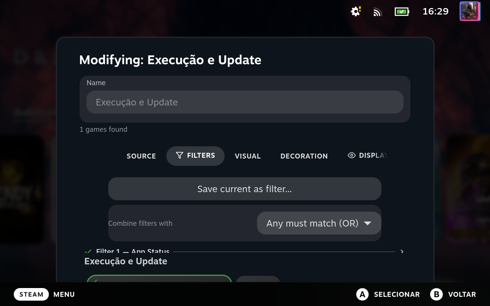

# Sistema de filtros

*[Read in English](../filters.md)*

O Deck Shelves suporta filtragem avançada de jogos com lógica AND/OR usando grupos de filtro.

<p align="center">
  
</p>

## Como uma prateleira é resolvida

Filtros são um estágio do pipeline que transforma a configuração de uma prateleira
nos cards na tela. Cada estágio abaixo é opcional, exceto a fonte:

```mermaid
flowchart LR
    source["Fonte<br/>coleção · aba · filtro ·<br/>nativa · wishlist · loja"]
    extra["Fontes adicionais<br/>combinadas como união ou interseção"]
    child["Filtro filho<br/>opcional, estreita o conjunto"]
    group["Grupo de filtro<br/>AND / OR sobre itens de filtro"]
    sort["Chaves de ordenação<br/>mais sortReverse"]
    limit["Limite"]
    out(["Conteúdo da shelf"])

    source --> extra
    extra --> child
    child --> group
    group --> sort
    sort --> limit
    limit --> out

    classDef src fill:#ede9fe,stroke:#7c3aed,color:#3b2a63
    classDef filt fill:#dbeafe,stroke:#2563eb,color:#12315e
    classDef ord fill:#fef3c7,stroke:#d97706,color:#5c3d0a
    classDef result fill:#dcfce7,stroke:#16a34a,stroke-width:2px,color:#14532d
    class source,extra src
    class child,group filt
    class sort,limit ord
    class out result
```



## Tipos de filtro

| Tipo | Descrição | Parâmetros |
|------|-------------|------------|
| `installed` | Jogos atualmente instalados | — |
| `favorites` | Jogos nos seus favoritos | — |
| `nonSteam` | Atalhos não-Steam (Epic, GOG, etc.) | — |
| `hidden` | Jogos ocultos | `mode`: `"only"` ou `"exclude"` |
| `updatePending` | Jogos com atualizações pendentes | — |
| `isNew` | Adicionados à biblioteca nos últimos 30 dias | — |
| `deckCompatibility` | Nível de compatibilidade com o Steam Deck | `levels`: `["verified", "playable", "unsupported", "unknown"]` |
| `steamosCompatibility` | Nota de compatibilidade com o SteamOS — distinta da Compatibilidade com o Deck (uma classificação diferente da Valve, mesma escala de 4 níveis) | `levels`: `["verified", "playable", "unsupported", "unknown"]` |
| `demo` | Listagens de demos da Steam | — |
| `playedWithinDays` | Jogado nos últimos N dias | `days`: número |
| `playtimeRange` | Tempo total de jogo numa faixa | `minHours`: número, `maxHours`: número (ambos opcionais) |
| `nameIncludes` | Nome contém a substring | `text`: string |
| `nameRegex` | Nome corresponde à regex | `pattern`: string |
| `collection` | Jogos numa coleção específica da Steam | `collectionId`: string |
| `developer` | Filtrar por nome de desenvolvedor | `developers`: string[] |
| `publisher` | Filtrar por nome de publisher | `publishers`: string[] |
| `appIdList` | Whitelist explícita de app IDs | `appIds`: número[] |
| `cloudAvailable` | Suporte a Steam Cloud | — |
| `controllerSupport` | Suporte nativo a controle | `min`: número (1 = parcial ou total, 2 = apenas total; padrão 1) |
| `shortcutType` | Filtrar por tipo de entrada: jogo (app_type 1 da Steam ou desconhecido), software (app_type 2), ferramenta (qualquer outro app_type da Steam), link (atalho não-Steam) | `kinds`: `("game" \| "software" \| "tool" \| "link")[]` (padrão `["game"]`) |
| `merge` | Grupo de predicados aninhado com seu próprio modo `and`/`or` (booleano por app) | `mode`: `"and"` \| `"or"`, `items`: FilterItem[] |
| `storeTag` | Tem tags específicas da loja Steam _(pass-through, ainda não avaliado)_ | `tags`: string[] |
| `achievements` | Faixa de contagem de conquistas _(pass-through, ainda não avaliado)_ | `min`, `max`: número |
| `friends` | Mínimo de amigos que possuem _(pass-through, ainda não avaliado)_ | `min`: número |

| `recentlyActive` | Jogado na janela da sessão atual | `minMinutes`: número |
| `neglected` | Não jogado há N dias | `days`: número |
| `systemCompatibility` | Roda nativamente / via camada de compatibilidade | — |
| `remotePlayLocation` | Disponibilidade de Remote Play | `mode`: `"local"` \| `"remote"` \| `"remote-only"` \| `"both"` |
| `libraryLocation` | Em qual biblioteca Steam o jogo está instalado | `category`: `"internal"` \| `"external"` \| `"network"` |
| `appStatus` | Atividade de download / atualização | `groups`: `("downloading" \| "queued" \| …)[]` |
| `friendsPlayingNow` | Amigos jogando no momento | — |
| `friendsPlayedRecently` | Amigos jogaram nos últimos N dias | `days`: número |
| `discount` | Faixa de porcentagem de desconto _(online)_ | `minDiscount`, `maxDiscount`: número |
| `priceRange` | Faixa de preço _(online)_ | `minPrice`, `maxPrice`: número (ambos opcionais) |

> **Nota:** `storeTag`, `achievements` e `friends` são armazenados e exportados corretamente, mas ainda não são avaliados em runtime — prateleiras que usam somente esses filtros retornarão todos os jogos da biblioteca.

### Biblioteca e metadados

| Tipo | Descrição | Parâmetros |
|------|-------------|------------|
| `genres` | Qualquer um dos gêneros listados | `genres`: string[] |
| `categories` | Qualquer uma das categorias de loja listadas | `categories`: string[] |
| `franchise` | Nome da franquia contém | `franchise`: string |
| `vrSupport` | Marcado como compatível com VR | — |
| `multiplayerType` | Capacidade multijogador | `kind`: `"any"` \| `"single"` \| `"multi"` \| `"coop"` \| `"online"` |
| `familySharing` | Marcado para o Compartilhamento Familiar da Steam | — |
| `dlcOwned` | Possui pelo menos N DLC | `minCount`: número |
| `soundtrackOwned` | Possui a trilha sonora | — |
| `compatDataQuality` | Tem alguma classificação de compatibilidade com o Deck | — |
| `reviewScore` | Nota de avaliações atinge um limite | `value`: número (0–100), `op`: `">="` \| `"<="` (padrão `">="`), `source`: `"metacritic"` \| `"steam"` (padrão `"metacritic"`) |
| `releaseDate` | Lançado antes/depois de uma data | `ts`: número (segundos Unix), `op`: `"after"` \| `"before"` (padrão `"after"`) |
| `comingSoon` | Ainda não lançado (data de lançamento futura) | — |

> **Onde cada um deles realmente lê seus dados:** `multiplayerType` e `vrSupport` leem os dados locais do próprio cliente Steam para jogos que você possui — instantâneo, funciona offline, sem precisar de Funcionalidades Online. `genres`, `categories`, `franchise`, `reviewScore`, `releaseDate` e `comingSoon` não têm nenhum dado local utilizável, mesmo para jogos da sua própria biblioteca, então eles buscam e fazem cache (da Loja para gêneros/categorias/nota-de-avaliação/data-de-lançamento, do cache de detalhes do cliente Steam para franquia) na primeira vez que um filtro desses roda — isso exige Funcionalidades Online ativadas, e numa biblioteca grande a primeira resolução só cobre um lote de jogos por vez, preenchendo o resto ao longo dos próximos refreshes em vez de tudo de uma vez. Todos esses também funcionam corretamente em cards de wishlist/loja que você ainda não possui. Todo outro filtro nesta seção é dado pessoal de jogo e só corresponde a jogos já na sua biblioteca.

### Uso e progresso

| Tipo | Descrição | Parâmetros |
|------|-------------|------------|
| `launchCount` | Número de execuções numa faixa | `min`, `max`: número (`max` omitido = sem limite superior) |
| `avgSessionMinutes` | Duração média de sessão numa faixa | `min`, `max`: número (minutos) |
| `playedOnce` | Jogado, mas no máximo N minutos | `maxMinutes`: número |
| `installedNeverPlayed` | Instalado com zero tempo de jogo | — |
| `neverCompleted` | Conclusão de conquistas abaixo de 100% | — |
| `achievementPercentRange` | Conclusão de conquistas numa faixa | `min`, `max`: número (0–100) |
| `recentlyAbandoned` | Jogado pela última vez entre N e M dias atrás | `minDaysAgo`, `maxDaysAgo`: número |

### Armazenamento

| Tipo | Descrição | Parâmetros |
|------|-------------|------------|
| `storageDevice` | Instalado no armazenamento interno ou cartão SD (heurística por padrão de caminho) | `device`: `"ssd"` \| `"sd"` |
| `installedSizeRange` | Tamanho instalado numa faixa | `minMB`, `maxMB`: número (o editor mostra GB) |

`libraryLocation` lê os próprios registros de biblioteca da Steam em vez de
adivinhar pelo caminho de instalação — ele também distingue bibliotecas de
rede e tem uma condição correspondente "Biblioteca disponível" em Regras de
Visibilidade / gatilhos de perfil.

### Atalhos não-Steam

| Tipo | Descrição | Parâmetros |
|------|-------------|------------|
| `emuDeckSystem` / `retroDeckSystem` | Atalho pertence ao EmuDeck / RetroDECK | — |
| `heroicLauncher` / `lutrisApp` | Atalho pertence ao Heroic / Lutris | — |
| `chiakiApp` / `moonlightApp` | Atalho de remote-play (Chiaki / Moonlight) | — |
| `hiddenLauncherShortcuts` | Atalho não-Steam oculto | — |
| `executableType` | Extensão do executável-alvo | `ext`: string (ex.: `exe`, `sh`) |
| `launchOptionTags` | Opções de inicialização contêm qualquer tag | `tags`: string[] |
| `customTags` / `parserCategories` | Corresponde a tags de usuário/parser | `tags`: string[] |

### Filtros compostos

Estes carregam uma lista de **itens de filtro filhos** em `children` — qualquer
tipo de filtro é permitido, e cada filho é avaliado através do avaliador de
filtro normal, então você pode aninhar faixas, correspondências de nome e os
tipos acima livremente.

| Tipo | Descrição | Parâmetros |
|------|-------------|------------|
| `weightedFilter` | Corresponde quando o peso somado dos filhos que correspondem atinge `threshold`. Com o peso padrão de 1, isso equivale a "pelo menos N dessas condições" | `children`: FilterItem[] (cada um pode carregar `weight`: número), `threshold`: número |
| `priorityFilter` | Corresponde quando qualquer filho corresponde (os filhos são checados em ordem) | `children`: FilterItem[] |
| `exclusionGroup` | Exclui o jogo quando qualquer filho corresponde | `children`: FilterItem[] |

O aninhamento tem um teto de profundidade em runtime, então uma árvore auto-referente não pode entrar em loop.

## Grupos de filtro

Filtros podem ser combinados usando grupos com lógica `AND` ou `OR`:

```json
{
  "filterGroup": {
    "mode": "and",
    "items": [
      { "type": "installed", "params": {} },
      { "type": "deckCompatibility", "params": { "levels": ["verified", "playable"] } }
    ]
  },
  "sort": "recent"
}
```

Cada item pode ser `inverted` para negar a condição:
```json
{ "type": "installed", "inverted": true, "params": {} }
```

> **Dica:** use `mode: "or"` quando você quer trazer jogos que correspondam a *qualquer uma* de várias condições — por exemplo, jogos de um desenvolvedor **ou** outro. Use `mode: "and"` (o padrão) quando toda condição precisa valer ao mesmo tempo.

> **Dica:** `inverted` está disponível na maioria dos tipos de filtro. Combine com `mode: "and"` para excluir subconjuntos específicos — ex.: jogos instalados que *não* estão ocultos.

### `merge` — grupos de predicados aninhados

`merge` permite que um único item de filtro carregue seu próprio sub-grupo com
um modo `and`/`or` independente, então você pode expressar lógica mais
complexa sem reestruturar o grupo pai. **Não** é uma união de listas — o pool
de origem continua o mesmo e cada app é testado uma vez. Misturar um grupo
`and` de nível superior com um filho `merge { or, ... }` é o formato mais comum.

Exemplo: incluir apps que são jogos Steam instalados **ou** qualquer atalho
não-Steam, numa única prateleira:

```json
{
  "filterGroup": {
    "mode": "and",
    "items": [
      {
        "type": "merge",
        "params": {
          "mode": "or",
          "items": [
            { "type": "installed", "params": {} },
            { "type": "nonSteam", "params": {} }
          ]
        }
      }
    ]
  }
}
```

Cada `appid` existe exatamente uma vez no pool de origem, então o resultado
não pode conter duplicatas, não importa quantos filhos de merge correspondam
ao mesmo app. "Mesmo título, appids diferentes" entre plataformas (ex.: cópias
Steam vs. Epic) **não** é resolvido aqui — `merge` não faz correspondência por
nome.

## Opções de ordenação

| Valor | Descrição |
|-------|-------------|
| `alphabetical` | A → Z |
| `recent` | Jogado por último (mais recente primeiro) |
| `playtime` | Tempo total de jogo (maior primeiro) |
| `release_date` | Data de lançamento (mais novo primeiro) |
| `size_on_disk` | Tamanho em disco (maior primeiro) |
| `metacritic` | Nota do Metacritic (maior primeiro) |
| `review_score` | Nota de avaliações da Steam (maior primeiro) |
| `added` | Data de aquisição na biblioteca (mais novo primeiro) |
| `app_status` | Atividade de download / atualização |
| `deck_compat` | Nota de compatibilidade com o Steam Deck |
| `controller_support` | Nível de suporte a controle |
| `price_low` | Preço, do menor primeiro _(online)_ |
| `discount_high` | Desconto, do maior primeiro _(online)_ |
| `original_price_high` | Preço original, do maior primeiro _(online)_ |
| `random` | Embaralhamento aleatório estável, renovado a cada 24 h |
| `manual` | Ordem definida pelo usuário (`manualOrder`); ids fora da lista caem para `manualBaseSort` |

Chaves de uso, progresso e armazenamento:

| Valor | Descrição |
|-------|-------------|
| `most_launched` / `least_launched` | Número de execuções |
| `longest_session` / `shortest_session` | Duração média de sessão |
| `most_ignored` | Mais tempo desde a última vez jogado |
| `rediscovered_recently` | Retomado mais recentemente |
| `completion_percent` | Conclusão de conquistas (maior primeiro) |
| `closest_to_completion` | Mais perto de 100% de conclusão |
| `rarest_achievements` | Conquistas mais raras obtidas |
| `newest_installed` / `oldest_installed` | Data de instalação |
| `oldest_unplayed` | Instalado há mais tempo com zero tempo de jogo |
| `newest_purchased` | Data de compra (mais novo primeiro) |
| `largest_install` / `smallest_install` | Tamanho instalado |
| `ssd_priority` / `sd_priority` | Armazenamento interno ou cartão SD primeiro |
| `friends_playing_now` | Amigos jogando no momento |
| `most_friends_owning` | Mais amigos que possuem |
| `trending_among_friends` | Atividade combinada dos amigos |
| `owned_games` | Jogos já na sua biblioteca local primeiro |
| `family_shared_games` | Jogos compartilhados por família primeiro |

Toda chave pode ser invertida com `sortReverse`.

### Ordenação por múltiplas chaves

`sort` aceita uma única chave (retrocompatibilidade) ou um array de chaves
para uma cadeia primária/secundária. `sortReverse` espelha a mesma forma — um
booleano para inverter toda chave, ou um `boolean[]` alinhado para direção por
chave.

```json
{ "sort": ["discount_high", "metacritic"], "sortReverse": [false, false] }
```

A primeira entrada é a primária; as seguintes desfazem empates. Internamente,
um único comparador composto percorre cada chave em ordem até que uma retorne
um resultado diferente de zero, e então a ordenação estável do JavaScript
preserva a ordem já estabelecida entre as passagens. Usar
`Array.sort().reverse()` por chave teria invertido itens empatados e desfeito
a ordenação secundária — veja `src/test/steam/applySortToIds.test.ts` para o
caso de regressão fixado.

`manual` e `random` não podem aparecer numa cadeia de múltiplas chaves (não
determinísticos — não se comportariam como desempatadores). O editor só os
expõe como a escolha primária de chave única; o resolver os descarta de
arrays encadeados.

O `sortReverse` por chave funciona para qualquer chave que o caminho de
múltiplas chaves suporta. Quando `sort` é um array e `sortReverse` é um
booleano, o booleano se aplica a toda chave.

## Fontes nativas

Além de uma coleção, aba de biblioteca ou filtro, uma prateleira pode se alimentar
de uma fonte pronta. Escolha **Fonte nativa** no editor de prateleira e selecione
uma; ela é armazenada como `{ "type": "builtin", "sourceId": "<id>" }` e não
recebe parâmetros adicionais.

| Grupo | Fontes |
|-------|---------|
| Steam | `dynamic_collections`, `followed_games`, `ignored_games`, `dlc_source`, `soundtrack_source` |
| Manual | `pinned_games`, `history_source`, `session_queue_source`, `temporary_queue_source` |
| Contextual | `recently_updated`, `with_events`, `with_workshop_updates`, `controller_specific_source` |
| Launchers | `emudeck_collections`, `retrodeck_collections`, `heroic_library`, `lutris_library`, `moonlight_sessions`, `chiaki_sessions` |

## Prateleiras com múltiplas fontes

Uma prateleira pode empilhar múltiplas fontes e combinar seus conjuntos de
resultado. O editor expõe isso implicitamente: escolha uma fonte primária,
depois clique em **+ Adicionar fonte** para empilhar extras. Prateleiras de fonte
única persistem sua fonte no formato plano (retrocompatibilidade); duas ou
mais colapsam numa fonte `composite` ao salvar:

```json
{
  "source": {
    "type": "composite",
    "combine": "union",
    "sources": [
      { "type": "collection", "collectionId": "my-favorites" },
      { "type": "wishlist" },
      { "type": "tab", "tab": "installed" }
    ]
  }
}
```

### Operadores de combinação

- `union` — jogos que aparecem em **qualquer** fonte filha. A ordem do
  primeiro filho vence; os filhos seguintes anexam seus itens na ordem de
  declaração, sem duplicatas.
- `intersection` — jogos que aparecem em **toda** fonte filha. A ordem de
  iteração segue o primeiro filho, então os usuários obtêm uma ordenação
  primária previsível.

### Regras de esgotamento por prateleira

Uma única prateleira não pode empilhar duas fontes idênticas (ex.: *Coleção A* +
*Coleção A*). O editor aplica isso por prateleira através de uma verificação de
esgotamento:

- **filter / wishlist / store** — limitado a 1 por prateleira. Assim que um está
  na lista de fontes, o tipo desaparece do menu "+ Adicionar fonte" para
  aquela prateleira.
- **tab / collection** — limitado ao tamanho total do catálogo Steam. Cada
  aba/coleção usada reduz as opções disponíveis; quando toda aba (ou coleção)
  já está em uso nessa prateleira, o tipo desaparece.
- A mesma fonte PODE aparecer em múltiplas prateleiras — o esgotamento é por
  prateleira, não global.

Para predicados com múltiplos critérios numa única fonte, use o
[filtro `merge`](#merge--grupos-de-predicados-aninhados) em vez de empilhar
múltiplas fontes `filter`.

### Teto de profundidade

Fontes compostas podem se aninhar (o schema permite isso para usuários
avançados editando JSON diretamente). O resolver limita a recursão a 4 níveis
de profundidade — além disso o ramo retorna um resultado vazio e registra um
warning. O editor só expõe um nível de aninhamento.

## Formato de filtro legado

> **Nota:** se você está importando prateleiras de um backup ou do TabMaster, a conversão para o formato de grupo acontece automaticamente — você não precisa migrar manualmente.

Configurações mais antigas podem usar um formato de filtro plano:
```json
{ "installed": true, "favorites": true, "sort": "alphabetical" }
```

Estes são convertidos automaticamente para o formato de grupo em runtime via `legacyFilterToGroup()`.

## Implementação

- Avaliação de filtro: `src/steam/index.ts` → `evaluateFilterItem()`, `evaluateFilterGroup()`
- UI de filtro: `src/components/FilterPanel.tsx`
- Conversão legada: `src/domain/settings.ts` → `legacyFilterToGroup()`
- Tipos de filtro personalizado: `src/domain/customfilters.ts`
