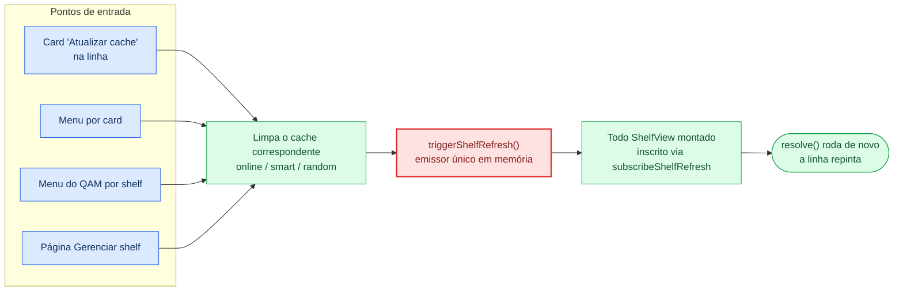

# Prateleiras online e funcionalidades online

*[Read in English](../online-shelves.md)*

Referência para as fontes de prateleira baseadas em rede e os mecanismos de
cache / atualização que as apoiam. Complementa [architecture.md](architecture.md)
(módulo de rede) e [filters.md](filters.md) (filtro `discount`).

---

## Fontes

Dois tipos de fonte são preenchidos a partir dos endpoints públicos da loja Steam:

- **`wishlist`** — os appids da wishlist da conta autenticada.
- **`store`** — catálogos de promoção (atualmente o browse de `/specials/`).

Ambos são opcionais: uma alternância mestre (`onlineFeaturesEnabled`) mais
sub-alternâncias por funcionalidade (`onlineWishlistEnabled`,
`onlinePriceSortEnabled`) condicionam toda chamada de rede. Com a alternância
mestre desativada, o resolver nunca sonda a rede e templates que exigem
funcionalidades online ficam ocultos do seletor.

Flags por prateleira sobrepostas:

| Flag | Efeito |
|---|---|
| `excludeOwned` | Descarta appids já na biblioteca local |
| `excludeOwnedNonSteam` | Estende o conjunto de possuídos a atalhos não-Steam |
| `hideOwnedNonSteamCloud` | Trata entradas de catálogo de jogo na nuvem como não possuídas |
| `childFilter` (FilterGroup) | Filtro adicional do lado do cliente aplicado sobre a lista resolvida |

O conjunto de "possuídos" vem de `getLocalLibraryAppIds()` em
`src/steam/index.ts`, que percorre `collectionStore.allGamesCollection`
(Steam) e `collectionStore.myGamesCollection` (Steam + atalhos) quando
`includeNonSteam` é verdadeiro. Atalhos de cloud-play são identificados por
pertencimento a coleção e descartados do conjunto de possuídos quando
`includeCloudPlay` é falso — então entradas do Xbox Cloud Gaming trazidas via
a integração Unifideck da Microsoft Store permanecem visíveis em prateleiras
online por padrão, mesmo com "Incluir atalhos não-Steam" ativado.

---

## Caches

| Chave (localStorage) | TTL | Limpo por |
|---|---|---|
| `ds-store-cache-v1` | implícito (limpo pelo usuário / instalação) | `clearOnlineShelfCache()` |
| `ds-wishlist-cache-v1` | implícito | `clearOnlineShelfCache()` |
| `ds-price-cache-v1` | 6 h (`data.fetchedAt` por app) | `clearOnlineShelfCache()` |
| `ds-game-name-cache-v1` | implícito | `clearOnlineShelfCache()` |
| `ds-shelf-cache-<shelfId>-<sort>-...` | 24 h | por prateleira, limpo na mudança de configuração |
| `ds-catalog-meta-cache-v1` | 7 d (por app) | ainda não conectado ao `clearOnlineShelfCache()` — veja abaixo |

O cache de preços alimenta:

- `discountPercent` no `DeckRowItem` (apenas no ramo de card online do
  `Shelf.tsx` — jogos possuídos não recebem mais um selo de desconto).
- As opções de ordenação `price_low` / `discount_high` / `original_price_high`
  em prateleiras online.
- O tipo de filtro `discount` (quando `allowOnlineFilters` está ativado, ou
  seja, dentro do editor de filtro filho para prateleiras de wishlist/loja).

O cache de nomes (`ds-game-name-cache-v1`) tem origem em
`fetchGameNames(appids)` em `src/core/onlineStore.ts` e alimenta o ramo
"card online" em `Shelf.tsx` para que entradas de wishlist que não estão no
appStore local ainda renderizem um título real em vez de `#appid`.

`ds-catalog-meta-cache-v1` (gêneros + categorias + suporte a VR,
`getCatalogMetaMap` em `src/core/onlineStore.ts`) é um tipo de cache
diferente dos quatro acima: não se trata de *quais jogos* mostrar numa prateleira
online, e sim de dados de gênero/categoria/VR para os **filtros**
`genres`/`categories`/`vrSupport`/`multiplayerType`, buscados por appid
(`store.steampowered.com/api/appdetails?filters=genres,categories` —
agrupar múltiplos appids numa requisição retorna 400 para essa combinação de
filtro, mesmo que `price_overview` funcione em lote normalmente, então as
requisições saem uma de cada vez, `CATALOG_CONCURRENCY = 4` em voo) e
consultado como fallback dentro de `rawField` do `v3Extensions.ts` para
qualquer campo que a visão geral real de um jogo possuído localmente não
carrega (veja [architecture.md](architecture.md#sistema-de-filtros-steamindexts--evaluatefiltergroup--componentsfilter)).
TTL de 7 dias — os dados de gênero/categoria mudam raramente o suficiente
para que um "Atualizar cache" acionado manualmente ainda não esteja
conectado para limpá-lo antecipadamente (diferente dos outros quatro caches
acima); ele vai pegar uma recategorização real dentro de uma semana.

Dados de franquia não têm nenhum cache persistente (`_franchiseCache` em
`v3Extensions.ts`, `Map` em memória, limpo no reload do plugin) — eles vêm de
`SteamClient.Apps.GetCachedAppDetails(appid).associations.rgFranchises`, o
próprio cache de detalhes de loja do **cliente** Steam, não uma busca que este
plugin faz diretamente. Funciona tanto para appids possuídos quanto não
possuídos, e é a única fonte de dados de franquia que existe (a API pública
da Loja não os expõe).

---

## Fluxo de atualização

Toda ação que invalida cache passa por `triggerShelfRefresh()` em
[src/core/shelfRefresh.ts](../../src/core/shelfRefresh.ts) — o único emissor
em memória ao qual todo `ShelfView` montado está inscrito via
`subscribeShelfRefresh(resolve)`. Os quatro pontos de entrada compartilham
esse caminho:

| Ponto de entrada | Cache limpo | Emissor |
|---|---|---|
| Card "Atualizar cache" na linha | `clearOnlineShelfCache()` | `triggerShelfRefresh()` |
| Menu por card → `Deck Shelves > Atualizar cache` (prateleiras online) | `clearOnlineShelfCache()` | `triggerShelfRefresh()` |
| Menu do QAM por prateleira → `Atualizar cache` | `clearOnlineShelfCache()` (online) / `invalidateSmartShelfCache()` (smart) / `invalidateRandomSortCache()` (random) | `triggerShelfRefresh()` |
| Página Gerenciar prateleira → `Atualizar cache` | mesmo que acima | `triggerShelfRefresh()` |

Para prateleiras não-online, o menu por card / por prateleira só invalida o cache
daquela prateleira (smart / random); o emit global ainda dispara, então o
`resolve()` da prateleira inscrita roda e a linha repinta.

O useEffect de metadados de `Shelf.tsx` **mescla** os novos metadados no mapa
`items` anterior (em vez de substituí-lo). Cards que sobreviveram à
atualização continuam visíveis durante o breve intervalo entre a chegada dos
novos `appIds` e o carregamento dos novos metadados — sem a mesclagem, cards
com o nome de fallback sintético (`App <id>`) eram removidos pela proteção
`isStoreFallback && !isOnlineSource` do ramo normal e só reapareciam na
rolagem.

---

## Derivação de autenticação e SteamID

Para a fonte de wishlist, o resolver precisa do SteamID64 da conta. O backend
tenta duas estratégias em ordem:

1. **API pública**, com o SteamID64 derivado da listagem do diretório
   userdata local (sem cookie, sem login necessário para perfis públicos).
   Implementação: `_get_steam_id64` em [main.py](../../main.py).
2. **JWT de cookie** lido do armazenamento de cookies do Chromium local da
   Steam, decriptado com AES-128-CBC via `openssl`. Implementação:
   `_get_steam_cookie`.

Ambas as buscas consultam `_steam_install_candidates()`, que centraliza a
descoberta da raiz de instalação da Steam — adicionar uma nova
plataforma/variante Flatpak é uma linha nesse helper. O caminho do cookie
anexa `config/htmlcache/Default/Cookies` a cada raiz; o caminho de userdata
anexa `userdata`. A primeira correspondência existente vence.

Plataformas atualmente cobertas:

| Plataforma | Raízes pesquisadas |
|---|---|
| Linux | `~/.local/share/Steam`, `~/.steam/steam`, `~/.var/app/com.valvesoftware.Steam/.local/share/Steam`, `~/.var/app/com.valvesoftware.Steam/data/Steam` |
| Windows | `%ProgramFiles(x86)%/Steam`, `%ProgramFiles%/Steam`, `%ProgramW6432%/Steam`, `%LOCALAPPDATA%/Steam`, `%APPDATA%/Steam` |
| macOS | `~/Library/Application Support/Steam` |

A decriptação do cookie chama o `openssl` (padrão POSIX) via subprocesso. Em
hosts Windows sem `openssl` no `PATH` o subprocesso falha e o chamador
recua graciosamente — o caminho da API pública via userdata ainda resolve o
SteamID, então a wishlist continua funcionando.

---

## Postura de privacidade

- Alternância mestre desativada → zero sondagens de rede (incluindo
  verificações de conectividade).
- A verificação de conectividade (`src/core/connectivity.ts`) só dispara
  antes de uma busca na loja.
- Sincronização de wishlist: uma vez por dia, resultados em cache no
  `localStorage`.
- Busca de preços: cache de 6 h por appid, só quando realmente necessário
  por uma prateleira visível.
- As leituras de cookie ficam confinadas ao perfil Steam do usuário sob a
  raiz de instalação correspondente; nada é enviado para fora.
- Nenhum serviço de terceiros é contatado. As URLs mostradas ao usuário na
  divulgação de privacidade (chave i18n `online_privacy_body`) correspondem
  ao que o resolver realmente contata.
- As buscas de gênero/categoria/franquia (acima) são condicionadas pela
  mesma alternância mestre, mas, diferente de wishlist/loja, elas agora
  também podem disparar numa **prateleira de biblioteca simples** — qualquer
  prateleira que use um filtro `genres`/`categories`/`franchise`, não só as de
  wishlist/loja. Mesmo domínio `store.steampowered.com` do resto deste
  documento; a busca de franquia é uma chamada de API do cliente Steam, não
  uma requisição que este plugin faz diretamente. O seletor de filtros
  oculta esses três tipos de filtro por completo enquanto a alternância
  mestre está desativada (`isOnlineFeatureFilterType`), então um usuário só
  de biblioteca nunca os aciona.
