# Screenshots

A visual tour of Deck Shelves. Captures are produced by the CDP screenshot
automation (see the [Development Guide](development.md#screenshots)) and live
in [`assets/screenshots/`](../assets/screenshots/).

## Home

  

  

## Plugin Settings

  

## Game Actions

  

## Shelf Management

  

  

  

  

  

  

  

  

  

  

## About & Filter Documentation

  

  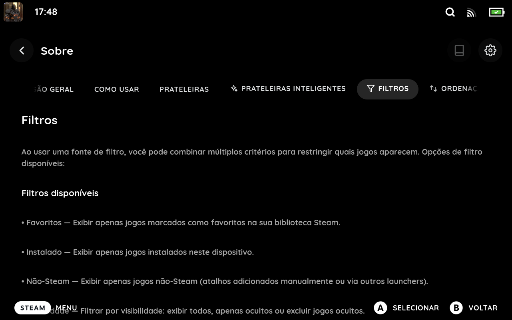

  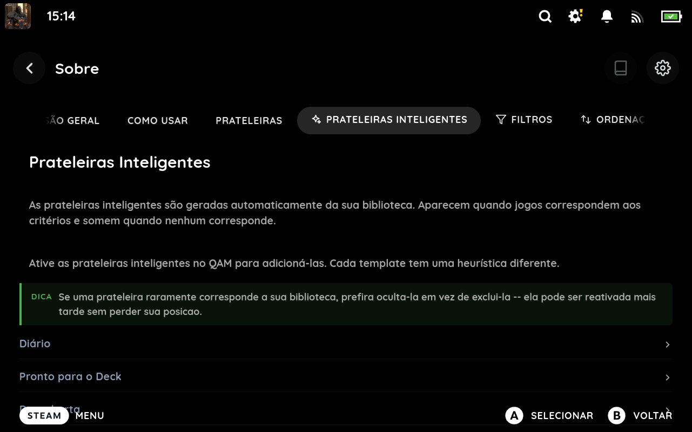

  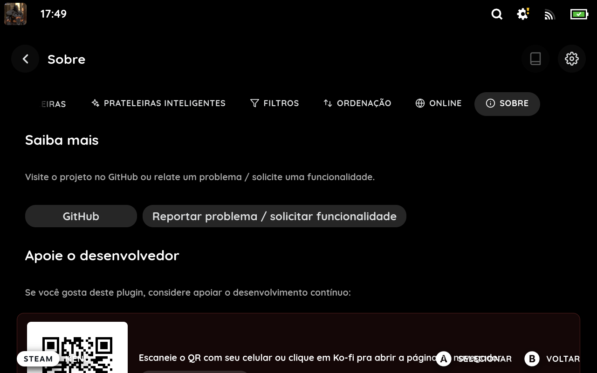

## Smart Shelves

  

  

  

## Saved Filters

Visible in the QAM when at least one filter has been saved from the
**Edit shelf → Filters** tab. Hidden automatically when empty.

  

## Global Toggles

  

## Settings page

The full-page Settings route, opened from the gear icon in the QAM title bar.

  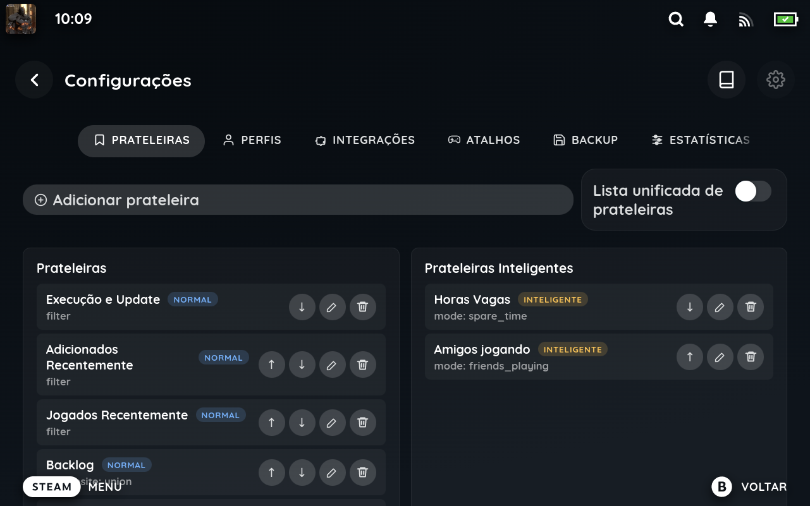

  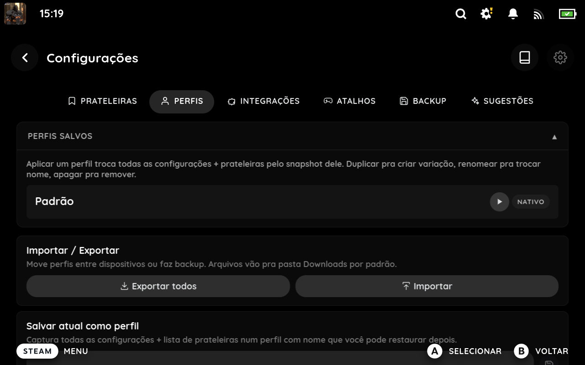

  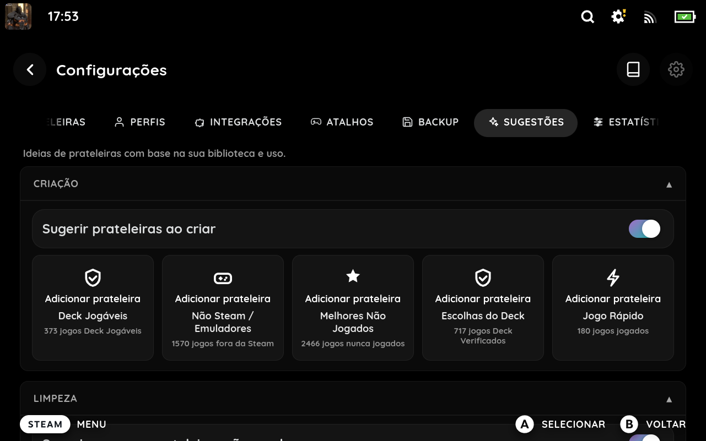

  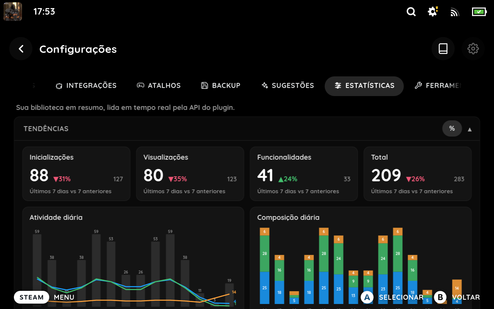

  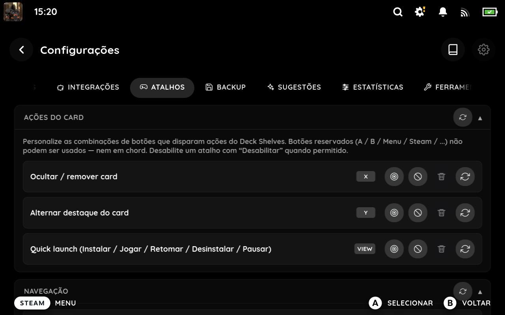

  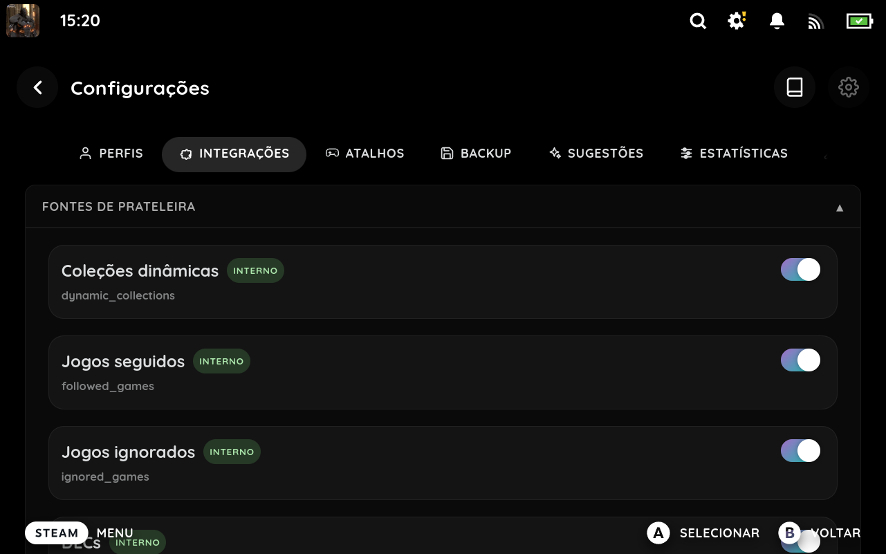

  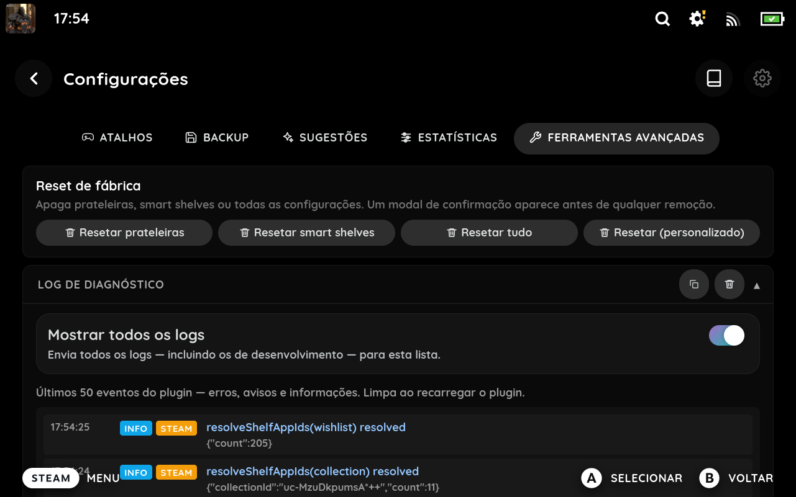

## Quick settings sidecar

The QAM's expandable **Settings** sidecar (dpad-right from the plugin
tab) — the plugin tab on the left, the populated Quick settings panel on the
right.

  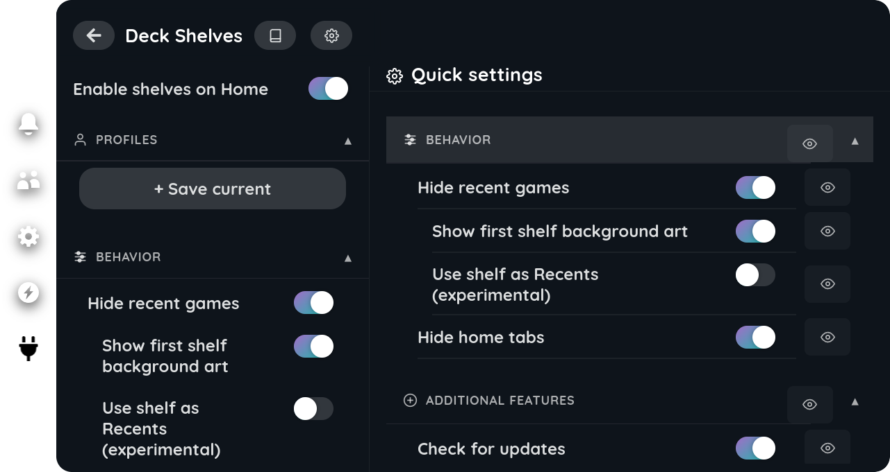

